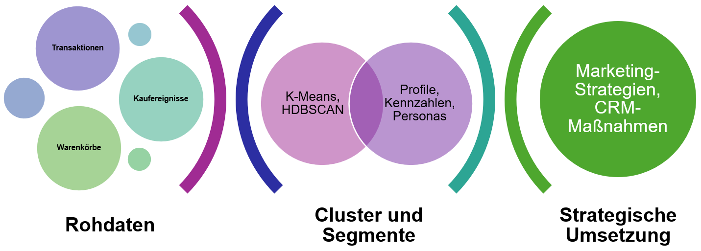
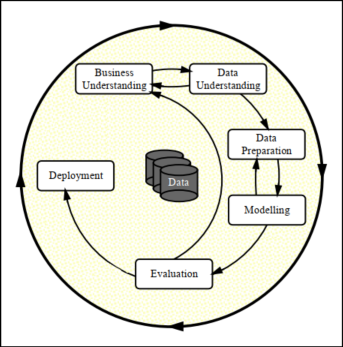
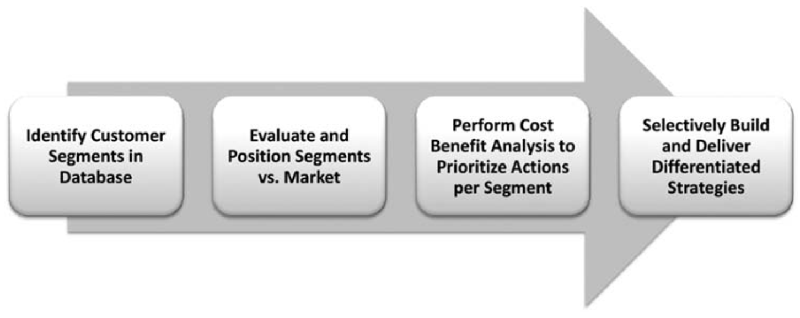
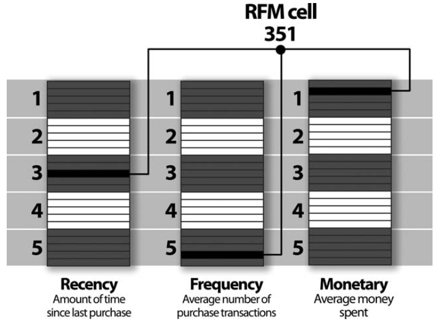

```{r r-setup}

#| eval=TRUE
#| message=FALSE
#| warning=FALSE
#| include=FALSE

# CRAN-Mirror setzen (WICHTIG: Vor allen anderen Operationen)
options(repos = c(CRAN = "https://cran.rstudio.com/"))

# Arbeitsumgebung leeren (alle Objekte entfernen)
rm(list = ls())
gc()

# Root für Quarto setzen
knitr::opts_knit$set(root.dir = here::here())

# Installiere und lade erforderliche Bibliotheken
if (!requireNamespace("reticulate", quietly = TRUE)) install.packages("reticulate")
if (!requireNamespace("rmarkdown", quietly = TRUE)) install.packages("rmarkdown")
if (!requireNamespace("shiny", quietly = TRUE)) install.packages("shiny")
if (!requireNamespace("dplyr", quietly = TRUE)) install.packages("dplyr")
if (!requireNamespace("tidyr", quietly = TRUE)) install.packages("tidyr")
if (!requireNamespace("tidyverse", quietly = TRUE)) install.packages("tidyverse")
if (!requireNamespace("forecast", quietly = TRUE)) install.packages("forecast")
if (!requireNamespace("ggpubr", quietly = TRUE)) install.packages("ggpubr")
if (!requireNamespace("viridis", quietly = TRUE)) install.packages("viridis")
if (!requireNamespace("naniar", quietly = TRUE)) install.packages("naniar")
if (!requireNamespace("GGally", quietly = TRUE)) install.packages("GGally")
if (!requireNamespace("corrplot", quietly = TRUE)) install.packages("corrplot")
if (!requireNamespace("kableExtra", quietly = TRUE)) install.packages("kableExtra")
if (!requireNamespace("gt", quietly = TRUE)) install.packages("gt")
if (!requireNamespace("grid", quietly = TRUE)) install.packages("grid")
if (!requireNamespace("gridExtra", quietly = TRUE)) install.packages("gridExtra")
if (!requireNamespace("patchwork", quietly = TRUE)) install.packages("patchwork")
if (!requireNamespace("mclust", quietly = TRUE)) install.packages("mclust")        
if (!requireNamespace("clustertend", quietly = TRUE)) install.packages("clustertend")  


library(reticulate)
library(rmarkdown)
library(shiny)
library(dplyr)
library(tidyr)
library(tidyverse)
library(forecast)
library(ggpubr)
library(viridis)
library(naniar)
library(GGally)
library(kableExtra)
library(gt)
library(grid)        
library(gridExtra)
library(patchwork)
library(mclust)        
library(clustertend)   

```

```{python python-setup}

#| eval=TRUE
#| message=FALSE
#| warning=FALSE
#| include=FALSE

# Erforderliche Bibliotheken installieren (falls nicht vorhanden)
import subprocess
import sys

def install_and_import(package_name, import_name=None):
    """
    Installiert ein Paket und importiert es.
    package_name: Name für pip install
    import_name: Name für import (falls unterschiedlich)
    """
    if import_name is None:
        import_name = package_name
    
    try:
        __import__(import_name)
    except ImportError:
        print(f"Installing {package_name}...")
        subprocess.check_call([sys.executable, "-m", "pip", "install", package_name])
    finally:
        globals()[import_name] = __import__(import_name)

# Bibliotheken mit korrekten Namen installieren
packages = [
    ("pandas", "pandas"),
    ("numpy", "numpy"), 
    ("matplotlib", "matplotlib"),
    ("seaborn", "seaborn"),
    ("scipy", "scipy"),
    ("statsmodels", "statsmodels"),
    ("pulp", "pulp"),
    ("scikit-learn", "sklearn"),  # Hier ist der Unterschied!
    ("hdbscan", "hdbscan"),
    ("pyreadr", "pyreadr")
]

for pkg_name, import_name in packages:
    install_and_import(pkg_name, import_name)

# Bibliotheken laden
import pandas as pd
import numpy as np
import matplotlib.pyplot as plt
import seaborn as sns
from scipy import stats
from statsmodels.tsa.seasonal import STL
from pulp import LpMaximize, LpProblem, LpVariable, value

# Scikit-learn Imports hinzufügen
from sklearn.preprocessing import StandardScaler
from sklearn.cluster import KMeans
from sklearn.metrics import silhouette_score
from sklearn.utils.validation import check_array

# HDBSCAN Import mit Fehlerbehandlung
try:
    import hdbscan
except ImportError:
    print("Installing hdbscan...")
    subprocess.check_call([sys.executable, "-m", "pip", "install", "hdbscan"])
    import hdbscan

# pyreadr Import
try:
    import pyreadr
except ImportError:
    print("Installing pyreadr...")
    subprocess.check_call([sys.executable, "-m", "pip", "install", "pyreadr"])
    import pyreadr

print("Alle Bibliotheken erfolgreich geladen!")
```


<!-- ================= 1. Einleitung ================= -->

# Einleitung {#sec-einleitung}

## Problemstellung {#sec-problemstellung}

Der Onlinehandel hat sich zu einem der wichtigsten Vertriebskanäle entwickelt. Millionen von Kunden kaufen regelmäßig ein, doch ihre Verhaltensweisen unterscheiden sich erheblich. Manche Kunden tätigen häufig kleine Käufe, andere bestellen selten, geben dabei aber hohe Summen aus. Hinzu kommen Unterschiede in der Sortimentswahl, im Preisbewusstsein und in der Reaktion auf Kampagnen.

Für Unternehmen liegt darin einerseits eine große Chance, da differenzierte Segmente eine gezielte Ansprache und Bindung ermöglichen. Andererseits stellt diese Vielfalt eine Herausforderung dar. Klassische Auswertungen wie Umsatzstatistiken oder Produktlisten zeigen nur an der Oberfläche Unterschiede, erfassen aber nicht die zugrunde liegenden Strukturen. Viele Segmentierungsprojekte scheitern daran, dass sie entweder methodisch zu stark auf Verfahren fokussieren oder dass die Ergebnisse nicht in verständliche, umsetzbare Formate übersetzt werden.

## Zielsetzung {#sec-zielsetzung}

Die Arbeit möchte die Forschungsfrage beantworten, welche Segmentstrukturen sich in E-Commerce-Daten verbergen und wie diese so dargestellt werden können, dass sie für Marketing und CRM unmittelbar nutzbar sind. Mit den Segmentprofilen, den Personas und den daraus abgeleiteten Maßnahmen wird gezeigt, wie Datenmuster in klare Handlungsoptionen übersetzt werden können. Clustering wird dabei als Werkzeug verstanden, nicht als Selbstzweck.

Der Beitrag dieser Arbeit liegt in drei Aspekten. Erstens wird ein nachvollziehbarer Prozess von der Datenbasis über die Merkmalsbildung bis zur Segmentierung entwickelt. Zweitens werden Segmentstrukturen durch Kennzahlen, Visualisierungen und narrative Personas anschaulich aufbereitet. Drittens werden praxisrelevante Maßnahmen für Marketing und Kundenbindung abgeleitet.

## Vorgehensweise {#sec-vorgehensweise}

Das Vorgehen orientiert sich am CRISP-DM-Modell. Zunächst werden theoretische Grundlagen der Kundensegmentierung und die Rolle von Validierungsmaßen erläutert. Anschließend werden die verwendeten Datensätze beschrieben und durch Feature Engineering in aussagekräftige Merkmale transformiert, unter anderem Recency, Frequency, Monetary Value sowie Warenkorb- und Sortimentsvariablen.

Die Segmentierung wird mit zwei Verfahren durchgeführt: K-Means dient als baseline für kompakte Cluster, während HDBSCAN unregelmäßige Strukturen und Rauschen abbilden kann. Die Qualität wird mit Silhouette und DBCV überprüft. Die Hopkins-Statistik wird ergänzend eingesetzt, wobei ihre eingeschränkte Aussagekraft für hochdimensionale Transaktionsdaten kritisch eingeordnet wird.

Im Ergebnisteil werden die Segmente dargestellt, mit Kennzahlen beschrieben und durch Visualisierungen anschaulich gemacht. Personas übersetzen die Ergebnisse in leicht verständliche Profile. Anschließend werden Implikationen für Marketing und CRM diskutiert. Die Arbeit schließt mit einer Reflexion der Ergebnisse, Limitationen und einem Ausblick auf zukünftige Erweiterungen.

<!-- ================= 2. Theoretischer Hintergrund ================= -->

# Theoretischer Hintergrund {#sec-theorie}

## Kundensegmentierung im E-Commerce {#sec-segmentierung-ecommerce}

Kundensegmentierung ist ein zentrales Instrument im Customer Relationship Management (CRM), um heterogene Kundenmengen in homogene Gruppen zu unterteilen und diese gezielt anzusprechen. @tsiptsisDataMiningTechniques2010, S. 39 betonen: “Clustering techniques identify meaningful natural groupings of records and group customers into distinct segments with internal cohesion.” Ziel ist die Entwicklung unterscheidbarer Kundentypologien, die „transparent, meaningful, and actionable“ sind (@tsiptsisDataMiningTechniques2010, S. 129).

Die Bedeutung von Kundensegmentierung im E-Commerce hat mit der Verfügbarkeit umfangreicher Transaktions- und Interaktionsdaten deutlich zugenommen. Personalisierte Angebote, zielgerichtete Kampagnen und differenzierte Kundenbindungsstrategien setzen voraus, dass heterogene Kundenmengen in konsistente Gruppen überführt werden können, die sich anhand ihres Verhaltens und Werts klar unterscheiden.

## Clustering als Mittel zum Zweck {#sec-clustering-werkzeug}

In dieser Arbeit wird Clustering nicht als Selbstzweck betrachtet, sondern als Werkzeug, um verborgene Muster zu erkennen und in verständliche Kundensegmente zu übersetzen. Zwei Verfahren stehen dabei im Mittelpunkt: K-Means und HDBSCAN.

K-Means basiert auf der Idee, die Varianz innerhalb von Clustern iterativ zu reduzieren. Es „starts with an initial cluster solution which is updated and adjusted until no further refinement is possible … Each iteration refines the solution by reducing the within-cluster variation“ (@tsiptsisDataMiningTechniques2010, S. 85). Jedes Cluster wird dabei durch sein Zentrum (Zentroid) repräsentiert, und die Anzahl der Cluster muss vorab festgelegt werden. Dieses Verfahren eignet sich besonders für kompakte, globuläre Strukturen. 

HDBSCAN hingegen ist eine Weiterentwicklung dichtebasierter Verfahren. Dichtebasierte Ansätze identifizieren Gruppen in Regionen hoher Punktdichte und weisen spärlich besetzte Bereiche als Rauschen aus; DBSCAN nutzt dafür die Parameter $\varepsilon$ und MinPts (@chakrabortyDataClassificationIncremental2022, S. 87–88). Damit lassen sich auch nicht-konvexe Formen abbilden und Ausreißer explizit behandeln. K-Means eignet sich dagegen vor allem für kompakte, annähernd kugelförmige Strukturen, während hierarchische bzw. dichtebasierte Verfahren arbiträre Formen robuster erfassen können (@chakrabortyDataClassificationIncremental2022, S. 96). HDBSCAN kombiniert diese Eigenschaften, indem es auf einer hierarchischen Betrachtung lokaler Dichten aufbaut und dadurch stabilere Cluster extrahieren kann.

Der gesamte Prozess wird im Rahmen von CRISP-DM strukturiert. @wirthCRISPDMStandardProcess2000, S. 4 beschreiben: „The life cycle of a data mining project is broken down in six phases“, die von Business Understanding über Data Understanding und Data Preparation bis zu Modeling, Evaluation und Deployment reichen. Diese Phasen sind nicht linear, sondern hochgradig iterativ: “it is never the case that a phase is completely done before the subsequent phase starts” (@wirthCRISPDMStandardProcess2000, S. 9). Eine ausführliche Darstellung und die konkrete Anwendung auf diese Arbeit finden sich in [A.1: CRISP-DM-Modell](#sec-anhangA.1).

<!-- ================= 3. Datenbasis und Aufbereitung ================= -->

# Datenbasis und Aufbereitung {#sec-datenbasis}

## Roadmap der Segmentierung im Projekt {#sec-roadmap}

Die Abbildung [@fig-segmentation-angepasst] veranschaulicht den konzeptionellen Ablauf der Segmentierung im Rahmen dieser Studie. Ausgangspunkt sind zahlreiche einzelne Beobachtungen, die in den Datensätzen Online Retail II und RetailRocket vorliegen. Diese Vielzahl an Transaktionen, Warenkörben und Interaktionen erscheint zunächst unstrukturiert und komplex.  

Im nächsten Schritt werden diese Daten mithilfe von Clustering-Verfahren wie K-Means und HDBSCAN in Gruppen überführt, die gemeinsame Muster erkennen lassen. Die entstehenden Cluster verdichten sich zu interpretierbaren Segmenten, die durch Kennzahlen, Profile und Personas beschrieben werden können. Dieser Übergang macht sichtbar, dass Segmentierung nicht nur eine rechnerische Klassifikation ist, sondern eine inhaltliche Reduktion von Datenkomplexität in klar unterscheidbare Kundengruppen.  

Der abschließende Teil der Abbildung symbolisiert die strategische Nutzung dieser Segmente. Auf Basis der erarbeiteten Kundengruppen können konkrete Maßnahmen für Marketing und CRM entwickelt werden. Damit endet der Prozess nicht bei der Modellierung, sondern wird in eine übergeordnete Strategie überführt, die operative Entscheidungen und Kampagnen unterstützt. Die Visualisierung verdeutlicht somit die Transformation von Rohdaten über Cluster und Segmente hin zu strategischen Maßnahmen und bildet den roten Faden für den weiteren praktischen Teil der Arbeit.  

{#fig-segmentation-angepasst width=100%}

Die dargestellte Roadmap knüpft an das in [A.2: Segmentation Management Strategy](#sec-anhangA.2) erläuterte Referenzmodell an. Sie macht deutlich, dass der Segmentierungsprozess als Abfolge von Transformationen zu verstehen ist, die von der Datenbasis über die Modellierung bis zur strategischen Umsetzung führen.

Im Anschluss an die Beschreibung der Datensätze erfolgt die Merkmalsbildung durch Feature Engineering. Dabei werden aus den Rohdaten zentrale Kennzahlen wie Recency, Frequency, Monetary Value sowie warenkorb- und sortimentsbezogene Variablen abgeleitet. Erst durch diese Konstrukte wird es möglich, im nächsten Schritt Clustermodelle anzuwenden.  

Schließlich wird im dritten Teil die Datenaufbereitung behandelt, die für die Robustheit der Modelle entscheidend ist. Dazu gehören die Bereinigung von Ausreißern, die Handhabung fehlender Werte sowie die Skalierung der Merkmale. Mit diesen vorbereitenden Schritten wird die Basis geschaffen, auf der die in der Roadmap dargestellte Transformation technisch und analytisch realisiert werden kann.


## Datensätze Online Retail II / RetailRocket {#sec-datensaetze}

Um die Forschungsfrage zu beantworten, welche Segmentstrukturen sich in E-Commerce-Daten verbergen und wie diese darstellbar sind, werden zwei komplementäre Datensätze genutzt. RetailRocket erfasst ereignisbasierte Interaktionen wie Ansichten, Warenkorbaktionen und Transaktionen [@zykovRetailrocketRecommenderSystem2022]. Online Retail II hingegen stellt transaktionsbasierte Rechnungsdaten mit Artikelnummern, Mengen, Preisen und Zeitstempeln bereit [@DatasetsUCIMachine2019].  

Die Kombination beider Perspektiven erlaubt es, sowohl verhaltensnahe Muster (RetailRocket) als auch wertorientierte Strukturen (Online Retail II) zu identifizieren. Damit wird die Grundlage gelegt, um robuste und vielseitige Segmentstrukturen zu erschließen.

<!-- ================= 4. Methodik (CRISP-DM: Modeling - theoretische Grundlagen)================= -->

# Methodik (CRISP-DM: Modeling - Theoretische Grundlagen)

## Feature Engineering und Preprocessing (RFM, Warenkorbgrößen, Sortimentsmerkmale – konzeptionell) {#sec-feature-engineering}

Damit Segmentstrukturen in den Daten sichtbar werden, müssen aus den Rohdaten aussagekräftige Merkmale abgeleitet werden. Dieser Schritt wird als Feature Engineering bezeichnet [@tsiptsisDataMiningTechniques2010, S. 337].

Im Zentrum stehen die klassischen RFM-Variablen, die drei grundlegende Dimensionen des Kaufverhaltens beschreiben:  
- *Recency* erfasst den zeitlichen Abstand seit dem letzten Kauf,  
- *Frequency* gibt die Anzahl der Käufe in einem bestimmten Zeitraum wieder,  
- *Monetary* misst den Umsatz im selben Zeitraum.  

Durch die Kombination dieser Dimensionen können Kunden in Zellen eingeteilt werden, die Verhalten und Wert systematisch abbilden. So steht etwa die Zelle 555 für besonders wertvolle Kunden (jüngster Kauf, hohe Frequenz, hoher Umsatz), während 151 Kunden mit langer Kaufpause, geringer Frequenz und geringem Umsatz beschreibt [@tsiptsisDataMiningTechniques2010, S. 334–338]. Diese Zellenlogik ist leicht verständlich, skaliert aber schlecht, da mit Quintilen bis zu 125 Klassen entstehen können.

Um diese Komplexität zu reduzieren, lässt sich RFM in eine kontinuierliche Kennzahl überführen. Dabei werden die drei Dimensionen zu einem gewichteten Summenscore zusammengefasst:

$$
\text{RFM-Score} = w_R \cdot R + w_F \cdot F + w_M \cdot M,
\qquad w_R + w_F + w_M = 1 .
$$

Der Vorteil dieser Verdichtung liegt in der besseren Vergleichbarkeit: Statt einer Vielzahl von RFM-Zellen entsteht eine eindimensionale Metrik, die sich leicht sortieren, gruppieren und auch als Input für Clusterverfahren verwenden lässt.

Die Gewichtung der Parameter ist flexibel gestaltbar. Unternehmen können etwa den zeitlichen Abstand (Recency) stärker gewichten, wenn Reaktivierungskampagnen im Vordergrund stehen, oder die Häufigkeit (Frequency), wenn Loyalität im Fokus liegt. Durch Variation der Gewichte $w_R$, $w_F$ und $w_M$ wird unmittelbar sichtbar, wie sich die Kundenklassifikation verschiebt [@tsiptsisDataMiningTechniques2010, S. 338].

Eine anschauliche Visualisierung der RFM-Zellen und ihrer logischen Struktur findet sich in [Anhang B.3: Retail-Segmentierung mit RFM](#sec-anhangB.3).  
<!--=== Hinzugefügt

Es lassen sich eindimensionale und mehrdimensionale RFM-Ansätze unterscheiden. Bei der eindimensionalen RFM-Segmentierung wird nur eine der drei Dimensionen (Recency, Frequency oder Monetary) zur Einteilung von Kunden herangezogen. Kunden werden dabei typischerweise in Quantile oder Klassen gruppiert, sodass beispielsweise die 20 % der Kunden mit der höchsten Kaufhäufigkeit in die oberste Kategorie fallen (@tsiptsisDataMiningTechniques2010, S. 333–336). Dieses Vorgehen ist leicht verständlich und ermöglicht eine schnelle Sortierung nach einzelnen Aspekten des Kaufverhaltens, bildet jedoch die Vielfalt der Kundenbeziehungen nur eingeschränkt ab. Eine detaillierte Übersicht findet sich inin [Anhang B.1: Eindimensionale RFM-Segmentierung](#sec-anhangB.1).  

Demgegenüber berücksichtigen mehrdimensionale Ansätze mehrere Merkmale gleichzeitig. Besonders etabliert ist die RFM-Analyse, die Recency, Frequency und Monetary Value kombiniert. @tsiptsisDataMiningTechniques2010, S. 337 schlagen vor, „to use the respective components as inputs in a clustering model and let the algorithm reveal the underlying natural groupings of customers“. Auf diese Weise entsteht ein mehrdimensionaler Merkmalsraum, in dem differenziertere Segmente sichtbar werden. Moderne Anwendungen erweitern RFM zudem um Variablen wie Warenkorbgrößen oder Sortimentspräferenzen. Eine detaillierte Übersicht zur RFM-Segmentierung findet sich in [Anhang B.2: Mehrdimensionale RFM-Segmentierung](#sec-anhangB.2).


===-->
Ergänzend zur klassischen RFM-Analyse werden in der Literatur weitere behaviorale Variablen vorgeschlagen, um das Kundenverhalten differenzierter zu erfassen. Besonders relevant sind *Warenkorbgrößen* und *Sortimentsmerkmale* [@tsiptsisDataMiningTechniques2010, S. 334].  

Warenkorbgrößen (*Basket Size*) beschreiben, wie umfangreich einzelne Bestellungen typischerweise ausfallen. Sie können entweder über die durchschnittliche Anzahl enthaltener Artikel oder über den durchschnittlichen Bestellwert erfasst werden. Formal lässt sich die mittlere Warenkorbgröße als Quotient aus der Gesamtzahl der Artikel eines Kunden und der Anzahl seiner Bestellungen ausdrücken:  

$$
\text{Average Basket Size} = \frac{\text{Gesamtzahl Artikel eines Kunden}}{\text{Anzahl seiner Bestellungen}} .
$$

Sortimentsmerkmale (*Relative Spending per Product Group*) erfassen die Breite beziehungsweise die Fokussierung der Ausgaben eines Kunden. Sie geben an, welcher Anteil des Gesamtumsatzes auf einzelne Produktgruppen entfällt. Formal kann der Anteil einer Kategorie $i$ als Verhältnis von Umsatz in dieser Kategorie zum Gesamtumsatz des Kunden dargestellt werden:  

$$
\text{Sortimentsanteil}_{i} = \frac{\text{Umsatz in Kategorie } i}{\text{Gesamtumsatz des Kunden}} .
$$


Ein hoher Wert in einer Kategorie kennzeichnet einen „Spezialisten“, während eine gleichmäßigere Verteilung auf viele Kategorien auf einen „Generalisten“ hinweist.  

Eine ausführlichere und beispielhafte Darstellung dieser Konzepte erfolgt in [Anhang B.4: Warenkorb- und Sortimentsmerkmale](#sec-anhangB.4), wo anhand von Illustrationen unterschiedliche Kundentypen wie „Frequent Shopper“, „Bulk Buyer“, „Generalisten“ und „Spezialisten“ gegenübergestellt werden.


## Clustering-Verfahren (K-Means, HDBSCAN - zentrale Eigenschaften) {#sec-clustering-verfahren}

In dieser Arbeit werden zwei komplementäre Verfahren eingesetzt, um unterschiedliche Strukturannahmen im Merkmalsraum abzudecken: **K-Means** als zentroidbasiertes Referenzverfahren sowie **HDBSCAN** als dichtebasierte, hierarchische Methode. Die Kombination erlaubt sowohl kompakte, annähernd kugelförmige Muster (K-Means) als auch unregelmäßige Strukturen mit lokal variierender Dichte und expliziter Rauschbehandlung (HDBSCAN) zu erfassen (@tsiptsisDataMiningTechniques2010, S. 85–86; @chakrabortyDataClassificationIncremental2022, S. 87–96).

\myheading{K-Means: Partitionierung mit Zentroiden}

K-Means „starts with an initial cluster solution which is updated and adjusted until no further refinement is possible … Each iteration refines the solution by reducing the within-cluster variation“ (@tsiptsisDataMiningTechniques2010, S. 85). Die Anzahl der Cluster *k* wird vorab festgelegt; jedes Cluster wird durch sein Zentrum (Zentroid) repräsentiert, typischerweise unter euklidischer Distanz. Damit liefert K-Means klar interpretierbare **Zentroidprofile**, ist aber am stärksten dort, wo Cluster kompakt und ungefähr kugelförmig sind (@tsiptsisDataMiningTechniques2010, S. 85–86).  

Für die Anfangswahl von *k* wird zunächst eine kleine Bandbreite getestet (z. B. k = 3–8); die **tatsächliche** Clusterzahl wird anschließend über interne Gütemaße (u. a. Silhouette, Davies–Bouldin) sowie Stabilität entschieden (vgl. Abschnitt \@sec-evaluation). Ergänzend verweisen neuere Arbeiten auf Varianten und Initialisierungsstrategien, die Robustheit und Konvergenz verbessern (@laiSilhouetteCoefficientbasedWeighting2025).

\myheading{HDBSCAN: Dichtebasierte Hierarchie mit Rauschen}

Dichtebasierte Ansätze identifizieren Cluster als Bereiche **hoher Punktdichte** und weisen dünn besetzte Regionen als **Rauschen** aus; klassisch erfolgt dies über ε und MinPts (DBSCAN). **HDBSCAN** erweitert dieses Prinzip hierarchisch, extrahiert stabile Cluster über ein Spektrum von Dichteschwellen und **erfordert keine feste Vorgabe von *k***. Dadurch lassen sich nicht-konvexe Formen, lokal variierende Dichten und Ausreißer natürlicher behandeln (@chakrabortyDataClassificationIncremental2022, S. 87–89, 96).  

Die Qualitätsbewertung dichtebasierter Lösungen erfolgt mit **DBCV** (Density-Based Clustering Validation), das die „within- and between-cluster density connectedness“ misst und den Einfluss von Rauschen sachgerecht einbezieht (@moulaviDensityBasedClustering2014).

\myheading{Warum zwei Verfahren?}

- **Modellannahmen**: K-Means adressiert kompakte Cluster und liefert gut lesbare Zentroidprofile (nützlich für Personas/Profiling). HDBSCAN erkennt **arbiträre Formen** und separiert **Rauschen**, was bei E-Commerce-Daten mit Ausreißern/Saisonalitäten vorteilhaft ist (@chakrabortyDataClassificationIncremental2022).  
- **Praxisnutzen**: Der Methoden-Kontrast reduziert das Risiko methodischer Scheinsicherheit und erhöht die Wahrscheinlichkeit, robuste, **geschäftlich interpretierbare** Segmente zu finden.  
- **Evaluation**: Je Verfahren passende Indizes: **Silhouette** und **Davies–Bouldin** für K-Means sowie **DBCV** für HDBSCAN; Stabilität via Bootstrapping/ARI, Clustertendenz vorab via **Hopkins** (vgl. \@sec-validierung und \@sec-evaluation; @laiSilhouetteCoefficientbasedWeighting2025; @moulaviDensityBasedClustering2014).

\myheading{Einbettung in CRISP-DM}

Die Modellierung folgt CRISP-DM: gemeinsame Merkmalsbasis (RFM, Warenkorb, Sortiment etc.), dann parallele Kalibrierung beider Verfahren und methodengerechte Validierung; Ergebnisse werden reproduzierbar dokumentiert und für die **Segmentprofile/Personas** aufbereitet (@wirthCRISPDMStandardProcess2000). 


## Clustertendenz und Modelle Hopkins, K-Means, HDBSCAN {#sec-clustertendenz}

Bevor konkrete Clusterverfahren eingesetzt werden, wird mit der Hopkins-Statistik geprüft, ob die Daten überhaupt eine erkennbare Tendenz zur Bildung von Clustern aufweisen. Werte nahe 0,5 deuten auf eine gleichmäßige Streuung ohne klare Gruppen hin, während Werte oberhalb von 0,75 auf deutliche Clustermuster schließen lassen. Vorgehen, Stichprobenumfang, Reproduzierbarkeit und Ergebniszusammenfassung sind in [Anhang C.6: Clustertendenz und Testverfahren](#sec-anhangC6) dokumentiert.

Aufbauend auf dieser Prüfung werden zwei komplementäre Verfahren eingesetzt, die unterschiedliche Strukturannahmen abdecken. K-Means dient als zentroidbasiertes Referenzverfahren und erzeugt gut interpretierbare Zentroidprofile, ist aber auf annähernd kugelförmige Strukturen ausgerichtet. Exemplarisch wird zunächst ein Startwert von k = 5 verwendet, um die Funktionsweise zu demonstrieren. Eine inhaltliche Entscheidung über die tatsächliche Clusterzahl erfolgt hier nicht, sondern systematisch in [Kapitel 4: Evaluation und Ergebnisse](#sec-evaluation) anhand geeigneter Gütemaße (u. a. Silhouette, Davies-Bouldin) und Stabilitätsprüfungen. Die konkreten Umsetzungsschritte stehen in [Anhang C.7: Modellierungsschritte K-Means und HDBSCAN](#sec-anhangC7).

Als dichtebasiertes Gegenstück wird HDBSCAN eingesetzt. Das Verfahren erfordert keine feste Clusterzahl, kann lokal unterschiedliche Dichten abbilden und weist dünn besetzte Bereiche als Rauschen aus. Dadurch werden neben größeren Segmenten auch Nischenmuster identifiziert. Parameterwahl und Export der Ergebnisse sind ebenfalls in [Anhang C.7](#sec-anhangC7) dokumentiert; die Qualität der resultierenden Lösungen wird in [Kapitel 4](#sec-evaluation) anhand dichtegeeigneter Indizes und Stabilitätsmaßen bewertet.

Damit ist die methodische Basis gelegt. Die Hopkins-Statistik begründet die Durchführung einer Clusteranalyse, und die Kombination aus K-Means und HDBSCAN stellt sicher, dass sowohl zentroidbasierte als auch dichtebasierte Strukturen erfasst werden.

## Validierung (Hopkins, Silhouette, DBCV) als Qualitätskontrolle {#sec-validierung}

Damit die mit Clustering identifizierten Muster belastbar sind, müssen ihre Ergebnisse überprüft werden. Dazu dienen Validierungsmaße, die im Folgenden vorgestellt werden.  

Die Hopkins-Statistik prüft, ob ein Datensatz überhaupt eine Clustertendenz enthält. @acitoPredictiveAnalyticsKNIME2023, S. 271 beschreiben sie als Maß, „to assess the clustering tendency of a data set by measuring the probability that a uniform data distribution generates a given data set“. Werte über 0,75 deuten auf eine starke Clustertendenz hin, Werte nahe 0,5 auf Zufälligkeit. Bei hochdimensionalen E-Commerce-Daten ist die Aussagekraft jedoch eingeschränkt, weshalb Hopkins in dieser Arbeit nur ergänzend berücksichtigt wird.  

Der Silhouette-Koeffizient bewertet die Kohäsion innerhalb von Clustern und die Separation zwischen Clustern. Er kombiniert also zwei Perspektiven: interne Homogenität und externe Abgrenzung. @tsiptsisDataMiningTechniques2010, S. 209 nennen die Silhouette als ein zentrales Kriterium der technischen Evaluation. @laiSilhouetteCoefficientbasedWeighting2025, S. 3063 ergänzen, dass sie ein objektives Maß sei, weil sie „both the cohesion within clusters and the separation between clusters“ berücksichtigt.  

Für dichtebasierte Verfahren wie HDBSCAN ist der DBCV-Index geeignet. @moulaviDensityBasedClusteringValidation2014, S. 839 erklären, dass DBCV die „within and between-cluster density connectedness“ misst, während Rauschen explizit berücksichtigt wird. Der Vorteil liegt darin, dass dieses Maß auch für arbiträre Clusterformen robust anwendbar ist (@moulaviDensityBasedClusteringValidation2014, S. 845).  

Dabei ist zu berücksichtigen, dass interne Validierungsmaße wie Silhouette oder DBCV lediglich strukturelle Eigenschaften der Clusterlösungen abbilden. Sie garantieren nicht, dass die Segmente geschäftlich relevant sind. Ohne eine anschließende inhaltliche Interpretation besteht die Gefahr, rechnerisch erzeugte Gruppen zu überinterpretieren.  

Diese theoretischen Grundlagen bilden den Rahmen, um in der folgenden Untersuchung herauszuarbeiten, welche Segmentstrukturen sich in E-Commerce-Daten verbergen und wie sie so beschrieben werden können, dass sie für Marketing und CRM unmittelbar nutzbar sind.

<!-- ================= 5. Ergebnisse und Diskussion (CRISP-DM: Modeling und Evaluation - praktisch) ================= -->

# Ergebnisse und Diskussion (CRISP-DM: Modeling und Evaluation - praktisch) {#sec-ergebnisse}

## Preprocessing (Bereinigung, Skalierung, Variablenableitung – Resultate, Details in Anhang C) {#sec-preprocessing}

Die Datensätze wurden zunächst bereinigt, Duplikate und fehlerhafte Einträge entfernt sowie Rückgaben separat behandelt. Anschließend erfolgte die Vereinheitlichung der Zeitstempel und die Konstruktion abgeleiteter Variablen (Umsatz = Preis × Menge). Über Recency, Frequency und Monetary Value hinaus wurden Merkmale wie Warenkorbgröße und Sortimentsvielfalt gebildet.
Zur Vergleichbarkeit aller Variablen wurde eine Standardisierung angewandt.
Die detaillierte Umsetzung und die Explorative Datenanalyse sind in Anhang C dokumentiert.

## Clustering (K-Means und HDBSCAN – Ergebnisse und Validierung) {#sec-clustering}

Zur Segmentierung wurden zwei Verfahren angewandt:

K-Means: Für verschiedene Clusterzahlen (k = 3–8) berechnet. Die Silhouette-Werte zeigten, dass eine 5-Cluster-Lösung eine gute Balance aus Trennschärfe und Interpretierbarkeit liefert.

HDBSCAN: Automatische Erkennung von Clustern mit variabler Dichte. Neben drei stabilen Segmenten wurde ein Teil der Kunden als Rauschen identifiziert. Der DBCV-Wert bestätigte eine robuste Abgrenzung der Cluster.

Die Validierung verdeutlicht, dass K-Means für kompakte Strukturen geeignet ist, während HDBSCAN flexibler auf unregelmäßige Muster reagiert.

## Interpretation der Segmente (Clusterprofile, Personas, Visualisierungen) {#sec-interpretation}

Die Cluster wurden anhand zentraler Kennzahlen interpretiert:

Cluster 1: Häufige Käufer mit mittlerem Warenkorbwert (loyale Stammkunden).

Cluster 2: Seltene Käufer mit hohen Umsätzen (Gelegenheitskunden mit Premium-Fokus).

Cluster 3: Wenige Käufe, geringer Umsatz (Kunden mit Abwanderungsrisiko).

Cluster 4: Sehr hohe Frequenz, kleine Warenkörbe (Schnäppchenjäger).

Cluster 5 (HDBSCAN): Unregelmäßiges Kaufmuster, oft saisonal bedingt (Gelegenheitsnutzer).

Diese Segmente wurden in Personas übersetzt und durch Visualisierungen unterstützt (siehe Anhang D
). Daraus lassen sich für Marketing und CRM differenzierte Maßnahmen ableiten, z. B. Reaktivierungskampagnen für Cluster 3 oder exklusive Angebote für Cluster 2.

<!-- ================= 6. Diskussion ================= -->

# Diskussion {#sec-diskussion}

## Vergleich der Verfahren {#sec-verfahren}

## Implikationen für Marketing und CRM {#sec-implikationen}

## Grenzen und methodische Limitationen {#sec-grenezen-limitationen}

<!-- ================= 7. Fazit und Ausblick ================= -->

# Fazit und Ausblick {#sec-fazit}

## Beantwortung der Forschungsfrage {#sec-forschungsfrage}

Die Arbeit hat gezeigt, dass sich in E-Commerce-Daten mehrere klar unterscheidbare Segmente identifizieren lassen. Diese unterscheiden sich sowohl in quantitativen Kennzahlen wie Kaufhäufigkeit, Umsatzhöhe und Sortimentspräferenzen als auch in charakteristischen Verhaltensmustern. Mit den aufbereiteten Profilen, Personas und Visualisierungen konnten die Unterschiede verständlich gemacht und in praxisnahe Maßnahmen überführt werden. Damit wurde die Forschungsfrage beantwortet, wie Segmentstrukturen in E-Commerce-Daten sichtbar gemacht und für Marketing und CRM nutzbar aufbereitet werden können.

Die eingesetzten Verfahren haben dabei ihren Zweck erfüllt. K-Means und HDBSCAN dienten als Werkzeuge, um Strukturen sichtbar zu machen. Silhouette und DBCV überprüften die Qualität der Ergebnisse. Die Hopkins-Statistik wurde ergänzend einbezogen, zeigte erwartungsgemäß kaum Clusterfähigkeit und machte deutlich, dass manche Validierungsansätze in diesem Kontext methodisch nur begrenzt aussagekräftig sind.

## Limitationen {#sec-limitationen}

Die Ergebnisse basieren auf internen Validitätsmaßen und bieten keinen direkten Nachweis, ob segmentbasierte Maßnahmen in der Praxis zu besseren Erfolgen führen. Auch die Datenbasis weist Einschränkungen auf. Transaktions- und Eventdaten sind häufig unbalanciert, enthalten Ausreißer und bilden nicht alle relevanten Kundenmerkmale ab. Die Generalisierbarkeit auf andere Märkte oder Shops ist daher begrenzt.

## Ausblick (z. B. Text Mining, Echtzeit-Segmentierung) {#sec-ausblick}

Für zukünftige Arbeiten empfiehlt sich die Ergänzung um externe Validierung. A/B-Tests und Uplift-Analysen könnten zeigen, ob segmentierte Kampagnen tatsächlich bessere Ergebnisse liefern. Eine Erweiterung der Merkmalsbasis durch Text Mining von Kundenbewertungen oder die Analyse von Session-Daten könnte zusätzliche Differenzierung schaffen. Auch eine dynamische Segmentierung, die sich in Echtzeit an Veränderungen im Verhalten anpasst, wäre ein sinnvoller Schritt. Schließlich sollte die Segmentlogik direkt in CRM-Systeme integriert werden, um einen geschlossenen Kreislauf zwischen Analyse, Umsetzung und Erfolgsmessung zu schaffen.

Was eine \gls{mfa} ist, wird im Glossar beschrieben.

<!-- ================= Literaturverzeichnis ================= -->

# Literaturverzeichnis {.unnumbered}

::: {#refs}
:::
\pagestyle{literature}
\markboth{Literaturverzeichnis}{Literaturverzeichnis}

\clearpage

<!-- ================= Anhangsverzeichnis-Header ================= -->

::: {#sec-anhang}
# Anhang {.unnumbered}
:::
\markboth{Anhang}{Anhang} 
\thispagestyle{empty}
\renewcommand{\thefigure}{A.\arabic{figure}}
\setcounter{figure}{0}

*Hinweis:* Alle Abbildungen in den Anhängen tragen das Präfix **A** in ihrer Nummerierung. 
Das **A** verweist zugleich auf den Anhang und wird fortlaufend gezählt.


<!-- ================= Anhangsverzeichnis ================= -->

::: {#sec-anhangsverzeichnis}
## Anhangsverzeichnis {.unnumbered}
:::
\pagestyle{appendixTOC}
\noindent

**Anhang A** [Modelle und Prozesse](#sec-anhangA) \dotfill  \pageref{sec-anhangA}

&nbsp;&nbsp;&nbsp;**A.1** [Das CRISP-DM-Modell](#sec-anhangA.1) \dotfill  \pageref{sec-anhangA.1}
 
&nbsp;&nbsp;&nbsp;**A.2** [Segmentation Management Strategy](#sec-anhangA.2) \dotfill  \pageref{sec-anhangA.2}


**Anhang B** [Clustering und RFM](#sec-anhangB) \dotfill  \pageref{sec-anhangB}

&nbsp;&nbsp;&nbsp;**B.1** [Eindimensionale RFM-Segmentierung](#sec-anhangB.1) \dotfill  \pageref{sec-anhangB.1}

&nbsp;&nbsp;&nbsp;**B.2** [Mehrdimensionale RFM-Segmentierung](#sec-anhangB.2) \dotfill  \pageref{sec-anhangB.2}

&nbsp;&nbsp;&nbsp;**B.3** [Retail-Segmentierung mit RFM](#sec-anhangB.3) \dotfill  \pageref{sec-anhangB.3}

**Anhang C** [Data Preparation](#sec-anhangC) \dotfill  \pageref{sec-anhangC}

&nbsp;&nbsp;&nbsp;**C.1** [Bereinigung (fehlende Werte, Duplikate, Rückgaben)](#sec-anhangC.1) \dotfill  \pageref{sec-anhangC.1}

&nbsp;&nbsp;&nbsp;**C.2** [Skalierung und Transformation](#sec-anhangC.2) \dotfill  \pageref{sec-anhangC.2}

&nbsp;&nbsp;&nbsp;**C.3** [Explorative Datenanalyse (zusätzliche Plots, Tabellen, Code)](#sec-anhangC.3) \dotfill  \pageref{sec-anhangC.3}

\clearpage

<!-- ================= Anhang ================= -->
\pagestyle{appendix} 
::: {#sec-anhangA}
# Anhang A: Prozessmodelle {.unnumbered}
:::
\markboth{Anhang B: Prozessmodelle}{}

Dieser Anhang stellt zwei etablierte Prozessmodelle vor, die für Datenanalyse und Segmentierungsstrategien maßgeblich sind. Mit dem CRISP-DM-Referenzmodell wird ein methodischer Rahmen für die systematische Durchführung von Data-Mining-Projekten beschrieben. Ergänzend veranschaulicht die Segmentation Management Strategy, wie analytisch gewonnene Kundensegmente in strategische Marketing- und CRM-Maßnahmen überführt werden können. Die Kombination macht deutlich, dass erfolgreiche Segmentierung sowohl methodisch fundiert als auch organisatorisch eingebettet sein muss.

\clearpage

::: {#sec-anhangA.1}
## A.1: Das CRISP-DM-Modell {.unnumbered}
:::

Die @fig-crisp-dm zeigt das CRISP-DM-Referenzmodell mit seinen sechs Phasen Business Understanding, Data Understanding, Data Preparation, Modeling, Evaluation und Deployment. Pfeile markieren die zentralen Abhängigkeiten, während der äußere Kreis den iterativen, zyklischen Charakter des Vorgehens unterstreicht. Das Modell ist als allgemeiner Rahmen entworfen und unabhängig von Anwendungsdomäne oder eingesetzter Software.


{#fig-crisp-dm width=50%}

Jede der sechs Phasen ist in spezifische Aufgaben untergliedert, die den Ablauf systematisieren und nachvollziehbar machen. So umfasst Data Understanding das Beschreiben, Erkunden und Überprüfen der Datenqualität, während Data Preparation Aufgaben wie Auswählen, Bereinigen, Konstruieren und Integrieren von Daten vorsieht. Modeling beinhaltet die Wahl geeigneter Verfahren, die Erstellung eines Testdesigns sowie den Aufbau und die Bewertung von Modellen. Evaluation konzentriert sich auf die Überprüfung der Ergebnisse im Hinblick auf die Projektziele, und Deployment behandelt die Bereitstellung und Nutzung der Modelle im Anwendungskontext. Wirth und Hipp betonen außerdem den stark iterativen Charakter des Modells: Ergebnisse einer Phase können jederzeit zu Rücksprüngen führen, wodurch die Arbeitsschritte flexibel angepasst werden können (@wirthCRISPDMStandardProcess2000, S. 6–9).


::: {#sec-anhangA.2}
## A.2: Segmentation Management Strategy {.unnumbered}
:::

Die in @fig-segmentation-strategy dargestellte Roadmap der *Segmentation Management Strategy* zeigt, wie analytisch ermittelte Segmente in eine unternehmerische Nutzung überführt werden können. Sie ergänzt das CRISP-DM-Modell, indem sie die Brücke von der technischen Modellierung hin zur strategischen Implementierung schlägt. Während CRISP-DM beschreibt, wie Daten zu Modellen verarbeitet werden, zeigt die Segmentation Management Strategy, wie diese Modelle in Marketing- und CRM-Maßnahmen eingebettet werden.  

{#fig-segmentation-strategy width=100%}

Die Roadmap besteht aus vier Schritten, die nacheinander zu durchlaufen sind: 

\medskip

**Schritt 1: Identify the customer segments in the database** \smallskip

\noindent Im ersten Schritt werden die ermittelten Segmente in die Kundendatenbank integriert. Kunden erhalten Scores und werden den Segmenten zugewiesen. @tsiptsisDataMiningTechniques2010, S. 213 betonen: *“Initially the segmentation results should be deployed in the customer database. Customers should be scored and assigned into segments.”* Damit ist die organisatorische Grundlage geschaffen, auf der weitere Analysen und Maßnahmen aufbauen.  

\medskip

**Schritt 2: Evaluate and position the segments**  \smallskip

\noindent In einem zweiten Schritt werden die Segmente bewertet und im Marktumfeld positioniert. Dazu gehören Marktumfragen und qualitative Analysen, die Segmente mit zusätzlichen Informationen wie Bedürfnissen, Lebensstil oder Status anreichern. Zudem sollen Wettbewerbsvorteile, Chancen und Risiken identifiziert werden. Die Autoren halten fest, dass *“the possible opportunities and threats should be investigated in order to select the key segments to be targeted with marketing activities tailored to their profiles and needs”* (@tsiptsisDataMiningTechniques2010, S. 214).  

\medskip

**Schritt 3: Perform cost-benefit analysis to prioritize actions per segment** \smallskip

\noindent Darauf folgt eine Kosten-Nutzen-Analyse, die die Profitabilität einzelner Segmente in Relation zu den erwarteten Kosten setzt. Behavioral Drivers wie Kaufhäufigkeit oder Abwanderungsrisiken spielen dabei eine zentrale Rolle. Ziel ist die Priorisierung der Segmente nach ökonomischer Relevanz. *“Effective segmentation management requires insight into the factors that drive customer behaviors … Finally, a cost–benefit analysis can enable the prioritization of the marketing actions to be implemented”* (@tsiptsisDataMiningTechniques2010, S. 215).  

\medskip

**Schritt 4: Build and deliver differentiated strategies** \smallskip

\noindent Im vierten Schritt werden die Segmente mit maßgeschneiderten Strategien adressiert. Spezialisierte Teams entwickeln und implementieren differenzierte Kampagnen, CRM-Maßnahmen und Produktstrategien. Dies umfasst Aspekte wie Kanalmanagement, Marketingservices, Produktmanagement und Markenführung. @tsiptsisDataMiningTechniques2010, S. 216 schreiben hierzu: *“Each team should build and deliver specialized marketing strategies to improve customer handling, develop the relationship with customers, and increase the profitability of each segment.”*  

Die Roadmap verdeutlicht, dass Segmentierung mehr ist als ein analytischer Prozessschritt. Sie muss in eine organisatorische und strategische Logik eingebettet werden, damit Segmente nicht nur statistisch existieren, sondern im Unternehmen handlungsleitend wirken. CRISP-DM liefert dafür den methodischen Rahmen, die Segmentation Management Strategy ergänzt ihn um eine explizite Managementperspektive.  

::: {#sec-anhangB}
# Anhang B: Clustering und RFM {.unnumbered}
:::
\markboth{Anhang B: Clustering und RFM}{}

Dieser Anhang erläutert die RFM-Segmentierung als ein klassisches Instrument der Kundenanalyse. Im Mittelpunkt stehen die Dimensionen Recency, Frequency und Monetary Value, mit denen Kundenverhalten in strukturierte Kategorien überführt werden kann. Die Darstellung zeigt sowohl einfache eindimensionale Ansätze als auch mehrdimensionale Ausprägungen, die eine differenziertere Sicht auf Kaufmuster und Kundenwert ermöglichen. Damit wird nachvollziehbar, weshalb RFM-Modelle eine wichtige Grundlage für moderne Verfahren der Kundensegmentierung bilden.

\clearpage

::: {#sec-anhangB.1}
## B.1: Eindimensionale RFM-Segmentierung {.unnumbered}
:::

Eindimensionale RFM-Segmentierung betrachtet jeweils nur eine Dimension des RFM-Modells – also Recency, Frequency oder Monetary – isoliert.  
Dabei werden Kunden typischerweise in Quantile eingeteilt. So werden beispielsweise die 20 % der Kunden mit der höchsten Kaufhäufigkeit in die oberste Kategorie (F = 5) eingeordnet, während die 20 % mit der geringsten Häufigkeit die niedrigste Stufe (F = 1) bilden [@tsiptsisDataMiningTechniques2010, S. 333–336].  

Dieser Ansatz ist leicht verständlich und ermöglicht eine schnelle Einordnung von Kunden nach einem einzelnen Aspekt des Kaufverhaltens. Allerdings bildet er die Gesamtkomplexität der Kundenbeziehungen nur eingeschränkt ab, da Interaktionen zwischen den Dimensionen unberücksichtigt bleiben.  


{#fig-rfm-cell width=70%}


::: {#sec-anhangB.2}
## B.2: Mehrdimensionale RFM-Segmentierung {.unnumbered}
:::

Die RFM-Analyse kombiniert drei Dimensionen: Recency, Frequency und Monetary Value. @tsiptsisDataMiningTechniques2010, S. 336–345 beschreiben RFM als bewährten Ansatz, um Kundenwerte differenziert abzubilden. Neben der klassischen Zellenbildung (z. B. Quintile) kann RFM auch als Input für Clustering genutzt werden. Dadurch entstehen mehrdimensionale Segmente, die sich deutlich voneinander unterscheiden. Erweiterungen des Modells beziehen zusätzliche Merkmale wie Warenkorbgrößen oder Sortimentspräferenzen ein, um die Aussagekraft weiter zu erhöhen.

::: {#sec-anhangB.3}
## B.3: Retail-Segmentierung mit RFM {.unnumbered}
:::

Ergänzend zur theoretischen Einführung im Hauptteil wird hier die Zellenlogik von RFM veranschaulicht.

Die folgende programmgenerierte Darstellung zeigt alle möglichen Kombinationen von *Recency* und *Frequency* auf einer Ebene mit festem *Monetary*-Wert. Die Zelle 351 ist dabei als Beispiel hervorgehoben.  

```{python, label=rfm}
#| eval: true
#| echo: true
#| results: hide
#| warning: false
#| message: false
#| fig-width: 10
#| fig-height: 6
#| fig-cap: "Eigene Darstellung eines RFM-Würfels"
#| fig-alt: "3D-Darstellung eines RFM-Würfels"
#| code-summary: "Code für RFM-Visualisierung anzeigen"

import matplotlib.pyplot as plt
from mpl_toolkits.mplot3d import Axes3D

fig = plt.figure(figsize=(12, 9))
ax = fig.add_subplot(111, projection='3d')

# RFM-Dimensionen
recency_range = range(1, 6)     # 1-5
frequency_range = range(1, 6)   # 1-5
monetary_level = 1              # Feste Ebene bei Z=1

# Vollständige Ebene bei Monetary = 1
for r in recency_range:
    for f in frequency_range:
        code = f"{r}{f}{monetary_level}"

        # Hervorhebung für Code "351"
        if code == "351":
            color = "red"           # Besondere Hervorhebung in rot
            text_color = "white"    # Weiße Schrift auf rot
        else:
            color = "lightgrey"
            text_color = "black"    # Schwarze Schrift auf grau

        # Korrigierte Positionierung: x=r, y=f, z=monetary_level
        ax.bar3d(
            x=r-0.5, y=f-0.5, z=monetary_level-0.1,  # Startposition (Ecke des Würfels)
            dx=1, dy=1, dz=0.2,                       # Größe
            color=color, edgecolor='black', alpha=0.9  # Weniger transparent
        )
       
        ax.text(
            r, f, monetary_level + 0.05,  # Leicht über der Oberfläche
            code,
            color=text_color,
            ha='center', va='center',
            fontsize=14,               # Noch größere Schrift
            weight='bold',             # ALLE Texte fett
            zorder=100                 # Text immer im Vordergrund
        )

# Achsentitel (korrekte Zuordnung)
ax.set_xlabel("Recency", fontsize=12, weight='bold')
ax.set_ylabel("Frequency", fontsize=12, weight='bold')
ax.set_zlabel("Monetary", fontsize=12, weight='bold')

# Achsenticks
ax.set_xticks(range(1, 6))
ax.set_xticklabels(['1', '2', '3', '4', '5'])
ax.set_yticks(range(1, 6))
ax.set_yticklabels(['1', '2', '3', '4', '5'])
ax.set_zticks(range(1, 6))

# Achsgrenzen
ax.set_xlim(0.5, 5.5)
ax.set_ylim(0.5, 5.5)
ax.set_zlim(0.5, 5.5)

# Seitenverhältnis & Perspektive
ax.set_box_aspect([1, 1, 1])  # Gleiche Proportionen
ax.view_init(elev=25, azim=45)  # Bessere Sicht
ax.grid(True)

# Überschrift mit RFM-Score Berechnung
ax.set_title("RFM-Würfel: Kontinuierlicher Score-Ansatz\n" +
             "RFM Score = (R×wR) + (F×wF) + (M×wM)\n" +
             "Ebene bei Monetary = 1 | Code 351 hervorgehoben", 
             fontsize=13, weight='bold', pad=20)

# Layout-Anpassung ohne Warnung
plt.subplots_adjust(left=0.1, right=0.9, top=0.85, bottom=0.1)  # Mehr Platz für Titel
plt.show()
```

\noindent Die Abbildung zeigt einen zweidimensionalen Ausschnitt des RFM-Modells in Würfelform: 

- Die x-Achse steht für *Recency* (Zeit seit dem letzten Kauf).
- Die y-Achse repräsentiert *Frequency* (Kaufhäufigkeit).
- Die z-Achse bildet *Monetary* (Umsatzhöhe) ab. In dieser Darstellung ist die Ebene mit *Monetary = 1* ausgewählt.

\medskip

Jede Zelle im Würfel steht für eine Kombination dieser drei Dimensionen und wird durch einen dreistelligen Code gekennzeichnet (z. B. 351 = Recency 3, Frequency 5, Monetary 1).  

Die hervorgehobene Zelle 351 veranschaulicht exemplarisch, wie einzelne Kundengruppen identifiziert werden können. Damit wird deutlich, dass das RFM-Schema ein Raster bildet, das eine differenzierte Beschreibung von Kundenverhalten ermöglicht.

::: {#sec-anhangB.4}
## B.4: Warenkorb- und Sortimentsmerkmale {.unnumbered}
:::

Dieser Abschnitt illustriert die im Hauptteil beschriebenen Konzepte *Warenkorbgrößen* und *Sortimentsmerkmale* anhand von Beispielen und Visualisierungen. Während @sec-feature-engineering die theoretischen Grundlagen und formalen Definitionen eingeführt hat, werden hier exemplarische Kundentypen wie „Frequent Shopper“, „Bulk Buyer“, „Generalisten“ und „Spezialisten“ dargestellt. Auf diese Weise wird deutlich, wie sich die abstrakten Kennzahlen in der Praxis auf konkrete Verhaltensmuster übertragen lassen.

\myheading{Warenkorbgr\"oßen}

\noindent Die @fig-warenkorb zeigt zwei kontrastierende Kundentypen: \smallskip

  - Kunde A („Frequent Shopper“) tätigt häufige, kleine Einkäufe.
  - Kunde B („Bulk Buyer“) kauft selten, aber in großen Mengen.

\bigskip  

Obwohl beide die gleiche Gesamtzahl an Artikeln kaufen, unterscheiden sie sich im Bestellverhalten fundamental. Diese Unterschiede lassen sich durch die *Average Basket Size* quantifizieren.

```{python}
#| label: fig-warenkorb
#| fig-cap: "Warenkorbanalyse verschiedener Kundentypen mit Durchschnittswerten, Bestellhäufigkeit und Vergleichsdarstellung"
#| fig-alt: "Visualisierung der Unterschiede zwischen Frequent Shopper und Bulk Buyer"
#| fig-width: 12
#| fig-height: 7

import matplotlib.pyplot as plt
import matplotlib.patheffects as path_effects
import numpy as np

# Daten für beide Kundentypen
customers = ["Kunde A\n(Frequent Shopper)", "Kunde B\n(Bulk Buyer)"]
basket_size = [2, 20]
order_count = [10, 2]
total_items = [20, 40]

# 3D-Farbpalette
colors_primary = ['#FF6B6B', '#4ECDC4']
colors_secondary = ['#E74C3C', '#45B7D1']
colors_scatter = ['#FF1744', '#00BCD4']

fig = plt.figure(figsize=(16, 10))

# Layout mit GridSpec - ERWEITERT für Kennzahlen
gs = fig.add_gridspec(3, 3, height_ratios=[2.5, 1, 0.8], width_ratios=[1, 1, 0.8], 
                     hspace=0.4, wspace=0.3, top=0.88, bottom=0.08)

# 3D Bar Charts
ax1 = fig.add_subplot(gs[0, 0])
ax2 = fig.add_subplot(gs[0, 1])
ax3 = fig.add_subplot(gs[1, 0])
ax4 = fig.add_subplot(gs[:2, 2])  # Rechts über 2 Zeilen
ax5 = fig.add_subplot(gs[2, :2])  # NEUE Kennzahlen-Zeile

# 1. Warenkorbgröße mit besserer Y-Achsen-Skalierung
bars1 = ax1.bar(customers, basket_size, color=colors_primary, alpha=0.9,
                edgecolor='black', linewidth=2, 
                width=0.6)
ax1.set_title('Durchschnittliche Warenkorbgröße', fontweight='bold', fontsize=12, pad=15)
ax1.set_ylabel('Artikel pro Bestellung', fontweight='bold')
ax1.grid(True, alpha=0.3, linestyle='--')
ax1.set_facecolor('#F8F9FA')
ax1.set_ylim(0, max(basket_size) * 1.3)

# Werte besser positioniert
for i, (bar, value) in enumerate(zip(bars1, basket_size)):
    text = ax1.text(bar.get_x() + bar.get_width()/2, bar.get_height() + max(basket_size) * 0.05, 
                   str(value), ha='center', va='bottom', fontweight='bold', fontsize=14,
                   color='white')
    text.set_path_effects([path_effects.withStroke(linewidth=2, foreground='black')])

# 2. Anzahl Bestellungen mit besserer Y-Achsen-Skalierung
bars2 = ax2.bar(customers, order_count, color=colors_secondary, alpha=0.9,
                edgecolor='black', linewidth=2,
                width=0.6)
ax2.set_title('Anzahl Bestellungen', fontweight='bold', fontsize=12, pad=15)
ax2.set_ylabel('Bestellungen gesamt', fontweight='bold')
ax2.grid(True, alpha=0.3, linestyle='--')
ax2.set_facecolor('#F8F9FA')
ax2.set_ylim(0, max(order_count) * 1.3)

# Werte besser positioniert
for i, (bar, value) in enumerate(zip(bars2, order_count)):
    text = ax2.text(bar.get_x() + bar.get_width()/2, bar.get_height() + max(order_count) * 0.05, 
                   str(value), ha='center', va='bottom', fontweight='bold', fontsize=14,
                   color='white')
    text.set_path_effects([path_effects.withStroke(linewidth=2, foreground='black')])

# 3. Scatter Plot GRÖSSER mit besserer Achsen-Skalierung
ax3.scatter(order_count, basket_size, s=[500, 500],
           c=colors_scatter, alpha=0.8, 
           edgecolors='black', linewidth=2,
           zorder=5)
ax3.set_xlabel('Anzahl Bestellungen', fontweight='bold', fontsize=11)
ax3.set_ylabel('Warenkorbgröße', fontweight='bold', fontsize=11)
ax3.set_title('Kundentypen im Vergleich', fontweight='bold', fontsize=13, pad=15)
ax3.grid(True, alpha=0.3, linestyle='--')
ax3.set_facecolor('#F8F9FA')

# Bessere Achsen-Grenzen für mehr Platz
ax3.set_xlim(0, max(order_count) * 1.2)
ax3.set_ylim(0, max(basket_size) * 1.2)

# Annotationen mit 3D-Effekt - größer
for i, customer in enumerate(['A', 'B']):
    ax3.annotate(f'Kunde {customer}', 
                xy=(order_count[i], basket_size[i]),
                xytext=(10, 10), textcoords='offset points',
                fontweight='bold', fontsize=12, color='white',
                bbox=dict(boxstyle="round,pad=0.4",
                        facecolor=colors_scatter[i], alpha=0.8, 
                        edgecolor='black', linewidth=2))

# 4. Strategische Implikationen mit kompakterem Layout
ax4.axis('off')

# 3D-artiger Hintergrund
ax4.add_patch(plt.Rectangle((0, 0), 1, 1, transform=ax4.transAxes, 
                           facecolor='lightgray', alpha=0.2, 
                           edgecolor='black', linewidth=1))

# Titel mit 3D-Box
ax4.text(0.05, 0.95, 'Strategische Implikationen', fontsize=12, fontweight='bold', 
         transform=ax4.transAxes, color='white',
         bbox=dict(boxstyle="round,pad=0.3", facecolor='steelblue', alpha=0.8, edgecolor='black'))

# Kunde A Implikationen - kompakter
ax4.text(0.05, 0.85, 'Kunde A (Frequent Shopper):', fontsize=10, fontweight='bold',
         transform=ax4.transAxes, color='white',
         bbox=dict(boxstyle="round,pad=0.2", facecolor='#FF6B6B', alpha=0.8, edgecolor='black'))

implications_a = ['• Häufige Kontaktpunkte', '• Loyalitätsprogramme', '• Cross-Selling-Potenzial']
for i, impl in enumerate(implications_a):
    ax4.text(0.05, 0.79 - i*0.05, impl, fontsize=9, transform=ax4.transAxes,
            bbox=dict(boxstyle="round,pad=0.15", facecolor='white', alpha=0.8, edgecolor='gray'))

# Kunde B Implikationen - kompakter
ax4.text(0.05, 0.60, 'Kunde B (Bulk Buyer):', fontsize=10, fontweight='bold',
         transform=ax4.transAxes, color='white',
         bbox=dict(boxstyle="round,pad=0.2", facecolor='#4ECDC4', alpha=0.8, edgecolor='black'))

implications_b = ['• Planungsorientiert', '• Volumenrabatte', '• Lagerservice']
for i, impl in enumerate(implications_b):
    ax4.text(0.05, 0.54 - i*0.05, impl, fontsize=9, transform=ax4.transAxes,
            bbox=dict(boxstyle="round,pad=0.15", facecolor='white', alpha=0.8, edgecolor='gray'))

# Fazit mit 3D-Effekt - kompakter
ax4.text(0.05, 0.35, 'Fazit:', fontsize=10, fontweight='bold',
         transform=ax4.transAxes, color='white',
         bbox=dict(boxstyle="round,pad=0.2", facecolor='darkgreen', alpha=0.8, edgecolor='black'))

ax4.text(0.05, 0.25, 'Beide Typen wertvoll, aber\nunterschiedliche Ansprache nötig', 
         fontsize=9, transform=ax4.transAxes, style='italic',
         bbox=dict(boxstyle="round,pad=0.15", facecolor='lightyellow', alpha=0.8, edgecolor='orange'))

# NEUE Kennzahlen-Ausgabe für Warenkorbanalyse
ax5.axis('off')
kennzahlen_text = f"""WARENKORBANALYSE: Kunde A - Warenkorbgröße: {basket_size[0]} Artikel | Bestellungen: {order_count[0]}/Periode | Kunde B - Warenkorbgröße: {basket_size[1]} Artikel | Bestellungen: {order_count[1]}/Periode | Verhältnis: {basket_size[1]/basket_size[0]:.1f}:1"""

ax5.text(0.5, 0.5, kennzahlen_text, fontsize=10, 
         transform=ax5.transAxes, ha='center', va='center',
         fontfamily='monospace', fontweight='bold',
         bbox=dict(boxstyle="round,pad=0.3", facecolor='gold', 
                  alpha=0.8, edgecolor='black', linewidth=2))

# 3D-Titel höher positioniert
plt.suptitle('Warenkorbstrategien: 3D-Analyse verschiedener Kundentypen', 
             fontsize=16, fontweight='bold', y=0.96,
             bbox=dict(boxstyle="round,pad=0.5", facecolor='gold', alpha=0.8, 
                      edgecolor='black', linewidth=2))

plt.tight_layout()
plt.show()

```

Die Visualisierung verdeutlicht, dass beide Kundentypen für ein Unternehmen wertvoll sein können, jedoch unterschiedliche Marketingstrategien erfordern. Während Frequent Shopper auf Loyalitätsprogramme und Cross-Selling reagieren, benötigen Bulk Buyer volumenorientierte Anreize und Serviceleistungen.

\myheading{Sortimentsmerkmale}

\noindent Die @fig-sortiment stellt das Verhalten eines Generalisten (Kunde C) und eines Spezialisten (Kunde D) gegenüber.


```{python}
#| label: fig-sortiment
#| fig-cap: "Sortimentsverhalten: Vergleich von Generalisten (gleichmäßige Diversifikation) und Spezialisten (dominante Kategorie)"
#| fig-alt: "Visualisierung der Unterschiede zwischen Generalisten und Spezialisten"
#| fig-width: 12
#| fig-height: 7

import matplotlib.pyplot as plt
import matplotlib.patheffects as path_effects
import numpy as np

# Beispiel: Sortimentsanteile
categories = ["Elektronik", "Kleidung", "Bücher", "Sport", "Haushalt"]

# Generalist: gleichmäßige Verteilung
generalist = [20, 20, 20, 20, 20]

# Spezialist: starke Fokussierung auf eine Kategorie
specialist = [80, 8, 5, 4, 3]

# Intensivere 3D-Farbpalette mit Verläufen
colors_generalist = ['#FF6B6B', '#4ECDC4', '#45B7D1', '#FFA07A', '#98D8C8']
colors_specialist = ['#E74C3C', '#3498DB', '#F39C12', '#9B59B6', '#2ECC71']

fig = plt.figure(figsize=(16, 9))

# Layout mit GridSpec - MEHR PLATZ OBEN für Titel
gs = fig.add_gridspec(3, 3, height_ratios=[2.5, 1, 0.8], width_ratios=[1, 1, 0.8], 
                     hspace=0.5, wspace=0.3, top=0.82, bottom=0.08)  # top reduziert für mehr Platz

# Charts definieren - ALLE WEITER UNTEN
ax1 = fig.add_subplot(gs[0, 0])  # Pie Chart 1
ax2 = fig.add_subplot(gs[0, 1])  # Pie Chart 2
ax3 = fig.add_subplot(gs[:2, 2])  # Rechts über 2 Zeilen
ax4 = fig.add_subplot(gs[1, :2])  # Tabelle
ax5 = fig.add_subplot(gs[2, :2])  # Kennzahlen-Zeile (bleibt)

# Generalist Pie Chart mit 3D-Effekt
wedges1, texts1, autotexts1 = ax1.pie(generalist, labels=categories, autopct='%1.0f%%',
                                      colors=colors_generalist,
                                      explode=(0.08, 0.08, 0.08, 0.08, 0.08),
                                      shadow=False,  # Schatten entfernt
                                      startangle=45,
                                      wedgeprops={'edgecolor': 'black', 
                                                'linewidth': 2,
                                                'linestyle': '-',
                                                'alpha': 0.9},
                                      textprops={'fontsize': 9, 
                                               'fontweight': 'bold',
                                               'color': 'white'})

ax1.set_title("Kunde C: Generalist\n(Gleichmäßige Diversifikation)", 
              fontsize=12, fontweight='bold', pad=15)

# Spezialist Pie Chart mit 3D-Effekt
wedges2, texts2, autotexts2 = ax2.pie(specialist, labels=categories, autopct='%1.0f%%',
                                      colors=colors_specialist,
                                      explode=(0.15, 0.03, 0.03, 0.03, 0.03),
                                      shadow=False,  # Schatten entfernt
                                      startangle=45,
                                      wedgeprops={'edgecolor': 'black', 
                                                'linewidth': 3,
                                                'linestyle': '-',
                                                'alpha': 0.9},
                                      textprops={'fontsize': 9, 
                                               'fontweight': 'bold',
                                               'color': 'white'})

ax2.set_title("Kunde D: Spezialist\n(Fokus auf Elektronik)", 
              fontsize=12, fontweight='bold', pad=15)

# Extra weiße, fette Schrift für 3D-Effekt
for autotext in autotexts1:
    autotext.set_color('white')
    autotext.set_fontweight('bold')
    autotext.set_fontsize(11)
    autotext.set_path_effects([path_effects.withStroke(linewidth=3, foreground='black')])

for autotext in autotexts2:
    autotext.set_color('white')
    autotext.set_fontweight('bold')
    autotext.set_fontsize(11)
    autotext.set_path_effects([path_effects.withStroke(linewidth=3, foreground='black')])

# Analyse-Panel rechts mit 3D-Box
ax3.axis('off')

# 3D-artiger Hintergrund
ax3.add_patch(plt.Rectangle((0, 0), 1, 1, transform=ax3.transAxes, 
                           facecolor='lightgray', alpha=0.3, 
                           edgecolor='black', linewidth=2))

ax3.text(0.05, 0.95, 'Sortiments-Analyse', fontsize=14, fontweight='bold', 
         transform=ax3.transAxes,
         bbox=dict(boxstyle="round,pad=0.3", facecolor='steelblue', alpha=0.7, edgecolor='black'))

# Kunde C Statistiken mit 3D-Boxen
ax3.text(0.05, 0.85, 'Kunde C (Generalist):', fontsize=11, fontweight='bold',
         transform=ax3.transAxes, color='white',
         bbox=dict(boxstyle="round,pad=0.3", facecolor='#FF6B6B', alpha=0.8, edgecolor='black'))

stats_c = ['• 5 aktive Kategorien', '• Diversitäts-Index: 1.00', 
           '• Gleichmäßige Verteilung', '• Cross-Selling-Potenzial']
for i, stat in enumerate(stats_c):
    ax3.text(0.05, 0.78 - i*0.04, stat, fontsize=10, transform=ax3.transAxes,
            bbox=dict(boxstyle="round,pad=0.2", facecolor='white', alpha=0.8, edgecolor='gray'))

# Kunde D Statistiken mit 3D-Boxen
ax3.text(0.05, 0.55, 'Kunde D (Spezialist):', fontsize=11, fontweight='bold',
         transform=ax3.transAxes, color='white',
         bbox=dict(boxstyle="round,pad=0.3", facecolor='#E74C3C', alpha=0.8, edgecolor='black'))

stats_d = ['• 5 Kategorien, 1 dominant', '• Diversitäts-Index: 0.37',
           '• 80% Fokus auf Elektronik', '• Category-Management']
for i, stat in enumerate(stats_d):
    ax3.text(0.05, 0.48 - i*0.04, stat, fontsize=10, transform=ax3.transAxes,
            bbox=dict(boxstyle="round,pad=0.2", facecolor='white', alpha=0.8, edgecolor='gray'))

# Strategische Implikationen - VERKÜRZT
ax3.text(0.05, 0.25, 'Strategische Implikationen:', fontsize=11, fontweight='bold',
         transform=ax3.transAxes, color='white',
         bbox=dict(boxstyle="round,pad=0.3", facecolor='darkgreen', alpha=0.8, edgecolor='black'))

ax3.text(0.05, 0.18, 'Verschiedene Strategien erfordern\nangepasste Ansätze', fontsize=10, 
        transform=ax3.transAxes, style='italic',
        bbox=dict(boxstyle="round,pad=0.2", facecolor='lightyellow', alpha=0.8, edgecolor='orange'))

# 3D-Tabelle unten
ax4.axis('off')

# Tabellen-Daten
table_data = [
    ['Merkmal', 'Generalist (Kunde C)', 'Spezialist (Kunde D)'],
    ['Kategorien aktiv', '5 (alle gleichmäßig)', '5 (1 dominant)'],
    ['Konzentration', '20% pro Kategorie', '80% Elektronik'],
    ['Diversität', 'Hoch (1.00)', 'Niedrig (0.37)'],
    ['Marketing-Fokus', 'Cross-Selling', 'Category-Expertise']
]

# Tabelle mit 3D-Effekt
table = ax4.table(cellText=table_data[1:], 
                 colLabels=table_data[0],
                 cellLoc='center',
                 loc='center',
                 bbox=[0, 0, 1, 1])

table.auto_set_font_size(False)
table.set_fontsize(9)
table.scale(1, 2.2)

# 3D-Header-Stil
for i in range(3):
    table[(0, i)].set_facecolor('#2C3E50')
    table[(0, i)].set_text_props(weight='bold', color='white')
    table[(0, i)].set_edgecolor('black')
    table[(0, i)].set_linewidth(2)

# 3D-Zeilen mit Farbverläufen
colors_rows = ['#ECF0F1', '#BDC3C7']
for i in range(1, 5):
    for j in range(3):
        table[(i, j)].set_facecolor(colors_rows[i % 2])
        table[(i, j)].set_edgecolor('black')
        table[(i, j)].set_linewidth(1)

# Kennzahlen-Ausgabe (BLEIBT WO SIE IST)
ax5.axis('off')
kennzahlen_text = f"""SORTIMENTSANALYSE: Kunde C - Konzentration: {max(generalist)}% (niedrig) | Kunde D - Konzentration: {max(specialist)}% (sehr hoch) | Verhältnis Hauptkategorie: {max(specialist)/max(generalist):.1f}:1"""

ax5.text(0.5, 0.5, kennzahlen_text, fontsize=10, 
         transform=ax5.transAxes, ha='center', va='center',
         fontfamily='monospace', fontweight='bold',
         bbox=dict(boxstyle="round,pad=0.3", facecolor='gold', 
                  alpha=0.8, edgecolor='black', linewidth=2))

# Titel HÖHER positioniert mit mehr Abstand
plt.suptitle('Sortimentsverhalten: Generalist vs. Spezialist', 
             fontsize=18, fontweight='bold', y=0.98,  # Höher positioniert
             bbox=dict(boxstyle="round,pad=0.5", facecolor='gold', alpha=0.8, edgecolor='black', linewidth=3))

plt.tight_layout()
plt.show()

```

Kunde C verteilt seine Ausgaben gleichmäßig über verschiedene Kategorien, was sich in einem hohen Diversitätsindex widerspiegelt und Cross-Selling-Potenzial bietet. Kunde D hingegen fokussiert sich stark auf eine einzige Kategorie, was eine spezialisierte Ansprache im Category-Management erforderlich macht.

\clearpage

::: {#sec-anhangC}
# Anhang C: Datenaufbereitung und Voranalysen {.unnumbered}
:::
\markboth{Anhang C: Datenaufbereitung und Voranalysen}{}

Dieser Anhang dokumentiert die technischen Schritte, die den Haupttext flankieren. Die Abschnitte C.1 bis C.5 stützen die in Abschnitt 3.2 beschriebenen Datensätze sowie die praktische Aufbereitung in Abschnitt 5.1. Abschnitt C.6 liefert die Vorprüfung der Clustertendenz und bildet damit die Brücke zwischen Abschnitt 4.3 Validierung theoretisch und Abschnitt 5.2 Clustering Ergebnisse. Abschnitt C.7 enthält die Implementierung der in Abschnitt 4.2 beschriebenen Verfahren und erzeugt die in Abschnitt 5.2 ausgewerteten Clusterzuordnungen. Die inhaltliche Deutung der Segmente erfolgt in Abschnitt 5.3.

\medskip

\noindent Der Anhang ist wie folgt gegliedert: \smallskip

  1. [Variablenbeschreibung und Quellen (C.1)](#sec-anhangC1)
  2. [Abbildung auf ein einheitliches Ereignisschema (C.2)](#sec-anhangC2)
  3. [Bereinigungsschritte und Qualitätsregeln (C.3)](#sec-anhangC3)
  4. [Normalisierung der Zeitstempel und Kalendermerkmale (C.4)](#sec-anhangC4)
  5. [Zusammenfassung des bereinigten Bestands und Plausibilisierung (C.5)](#sec-anhangC5)
  6. [Clustertendenz mit der Hopkins-Statistik als Vorprüfung](#sec-anhangC.6)
  7. [Modellierungsschritte in Python für K-Means und HDBSCAN](#sec-anhangC.7)
  
\medskip

In den Abschnitten C.1–C.5 wird mit R gearbeitet, um die Daten zu laden, bereinigen und in ein konsistentes Schema zu überführen. Ab C.6 kommen Python und spezialisierte Bibliotheken für Clustertendenz, Modellierung und Evaluation zum Einsatz. Diese Aufgabenteilung folgt der Praxis vieler Forschungsarbeiten: R für transparente Datenaufbereitung, Python für Machine Learning.

::: {#sec-anhangC.1}
## C.1 Variablenbeschreibung und Quellen {.unnumbered}
:::

```{r C.1-Variablenbeschreibung_und_Quellen}

#| eval=TRUE
#| echo=TRUE
#| include=TRUE
#| results=TRUE
#| message=FALSE
#| warning=FALSE


# Pakete laden
library(readr)
library(dplyr)
library(here)

# Versionen dokumentieren
pkgs <- c("readr","dplyr","here")
vers <- sapply(pkgs, function(p) as.character(utils::packageVersion(p)))
attached <- pkgs %in% sub("^package:", "", search())
data.frame(package = pkgs, version = vers, attached = attached)

# Pfade bauen
p_events <- here("data","RR","events.csv")
p_item1  <- here("data","RR","item_properties_part1.csv")
p_item2  <- here("data","RR","item_properties_part2.csv")
p_cat    <- here("data","RR","category_tree.csv")
p_or2    <- if (file.exists(here("data","OR2","online_retail_II.csv"))) {
              here("data","OR2","online_retail_II.csv")
            } else {
              here("data","OR2","online_retail_ll.csv")
            }

# Laden
events        <- read_csv(p_events, show_col_types = FALSE)
item_props_1  <- read_csv(p_item1,  show_col_types = FALSE)
item_props_2  <- read_csv(p_item2,  show_col_types = FALSE)
category_tree <- read_csv(p_cat,    show_col_types = FALSE)
online_retail <- read_csv(p_or2,    show_col_types = FALSE)

# Erste 5 Zeilen je Datensatz
head(events, 5)
head(item_props_1, 5)
head(item_props_2, 5)
head(category_tree, 5)
head(online_retail, 5)

```

\bigskip

\noindent Die Ausgaben verdeutlichen die Struktur der Datensätze. Zur besseren Übersicht werden die wichtigsten Variablen und ihre Bedeutungen zusätzlich tabellarisch dargestellt:

| Variable             | Quelle                          | Bedeutung                                                                 |
|----------------------|---------------------------------|---------------------------------------------------------------------------|
| `timestamp`          | RetailRocket (events)           | Zeitstempel in Millisekunden seit 1970, Angabe des Ereigniszeitpunkts     |
| `visitorid`          | RetailRocket (events)           | Anonymisierte Kennung eines Besuchers                                     |
| `event`              | RetailRocket (events)           | Typ des Ereignisses: *view*, *addtocart*, *transaction*                   |
| `itemid`             | RetailRocket (events)           | Artikelkennung                                                            |
| `transactionid`      | RetailRocket (events)           | ID der Transaktion (optional, nur bei Käufen)                             |
| `property`           | RetailRocket (item_properties)  | Attribut eines Artikels (z. B. Kategorie, Preis, technische Merkmale)     |
| `value`              | RetailRocket (item_properties)  | Wert des jeweiligen Attributs                                             |
| `categoryid`         | RetailRocket (category_tree)    | Identifikator einer Kategorie                                             |
| `parentid`           | RetailRocket (category_tree)    | Übergeordnete Kategorie, beschreibt die Hierarchie                        |
| `Invoice`            | Online Retail II                | Rechnungsnummer                                                           |
| `StockCode`          | Online Retail II                | Artikelcode                                                               |
| `Description`        | Online Retail II                | Kurzbeschreibung des Artikels                                             |
| `Quantity`           | Online Retail II                | Menge der verkauften Artikel                                              |
| `InvoiceDate`        | Online Retail II                | Zeitstempel der Rechnungsstellung                                         |
| `Price`              | Online Retail II                | Einzelpreis pro Artikel                                                   |
| `Customer ID`         | Online Retail II                | Anonymisierte Kundenkennung                                               |
| `Country`            | Online Retail II                | Land des Kunden                                                           |

: Übersicht der Variablen in beiden Datenquellen {#tbl-variablen}

\medskip

\noindent Diese Gegenüberstellung verknüpft die in 3.2 beschriebenen Quellen mit den nachfolgenden Transformationsschritten.

::: {#sec-anhangC.2}
## C.2: Abbildung auf ein einheitliches Ereignisschema {.unnumbered}
:::

Ziel ist ein gemeinsames Schema für beide Quellen. RetailRocket liefert Interaktionen, Online Retail II liefert Käufe. Das vereinheitlichte Ereignisschema ermöglicht konsistente Merkmalsbildung für 4.1 und robuste Inputs für 4.2–4.3.

Zuordnung der Quell- zu den Zielvariablen

| Zielvariable            | RetailRocket (Quelle)             | Online Retail II (Quelle) | Bedeutung                                          |
|-------------------------|-----------------------------------|---------------------------|----------------------------------------------------|
| `customer_id`           | `visitorid`                       | `Customer ID`              | Anonymisierte Kennung des Kunden                   |
| `item_id`               | `itemid`                          | `StockCode`               | Artikelkennung                                     |
| `timestamp`             | `timestamp` (ms seit 1970)        | `InvoiceDate`             | Zeitpunkt des Ereignisses / der Transaktion        |
| `event_type`            | `event` (*view*, *addtocart*, *transaction*)      | implizit: immer *purchase* | Typ des Ereignisses               |
| `transactionid`         | `transactionid` (falls Kauf)      | `Invoice`                 | Eindeutige Transaktionskennung                     |
| `quantity`              | nicht enthalten                   | `Quantity`                | Anzahl der verkauften Artikel                      |
| `price`                 | über `item_properties`            | `Price`                   | Einzelpreis pro Artikel                            |
| `revenue`               | berechnet: quantity × price       | berechnet: Quantity × Price | Umsatz pro Ereignis                              |
| `category`              | aus `category_tree`               | ggf. aus `Description`    | Zuordnung zu einer Produktkategorie                |

: Abbildung der Variablen auf das Ereignisschema {#tbl-ereignisschema}

\medskip
<!--== passt das noch?
\noindent Während RetailRocket eine feingranulare Unterscheidung nach Ereignistypen erlaubt (*view*, *addtocart*, *transaction*), bildet Online Retail II ausschließlich abgeschlossene Käufe ab. Beide Datensätze liefern somit unterschiedliche, aber komplementäre Informationen.  
==-->
Die Abbildung in ein gemeinsames Schema stellt sicher, dass spätere Merkmalsberechnungen (z. B. Recency, Frequency, Monetary-Werte, Kaufintervalle, Diversität) auf konsistenter Datenbasis erfolgen können.  

Die Umsetzung der Transformation erfolgt mit R. Der folgende Chunk zeigt exemplarisch, wie die Zielvariablen aus beiden Quellen generiert werden.


```{r C.2-Einheitliches_Ereignisschema}


#| eval: TRUE
#| echo: TRUE
#| include: TRUE
#| results: TRUE
#| message: FALSE
#| warning: FALSE

library(dplyr)
library(lubridate)

# RetailRocket in UTC einlesen, dann auf Europe/London abbilden
rr_events <- events %>%
  transmute(
    customer_id   = visitorid,
    item_id       = itemid,
    timestamp     = as.POSIXct(timestamp/1000, origin = "1970-01-01", tz = "UTC"),
    event_type    = event,
    transactionid = transactionid
  ) %>%
  mutate(timestamp = with_tz(timestamp, "Europe/London"),
         quantity  = NA_real_,
         price     = NA_real_,
         revenue   = NA_real_,
         category  = NA_character_)

# Online Retail II: lokale Zeiten explizit als Europe/London interpretieren
or2_events <- online_retail %>%
  transmute(
    transactionid = Invoice,
    item_id       = StockCode,
    customer_id   = `Customer ID`,
    timestamp     = force_tz(InvoiceDate, "Europe/London"),
    quantity      = Quantity,
    price         = Price,
    country       = Country,
    description   = Description,
    event_type    = "purchase",
    revenue       = Quantity * Price,
    category      = Description
  )

head(rr_events, 5)
head(or2_events, 5)


```

\medskip

\noindent In der harmonisierten Tabelle von RetailRocket bleiben die Variablen `quantity`, `price`, `revenue` und `category` zunächst leer, da diese Informationen im Rohdatensatz nicht in direkter Form vorliegen. Diese Spalten wurden dennoch angelegt, um die Struktur beider Quellen konsistent zu halten und spätere Ergänzungen zu ermöglichen.  

Bei Online Retail II sind diese Variablen hingegen vollständig verfügbar: Transaktionskennungen, Mengen, Preise und Umsätze können direkt übernommen werden. Der Ereignistyp ist dort implizit immer ein Kauf (*purchase*), sodass keine Unterscheidung zwischen verschiedenen Interaktionen möglich ist.  

Die Abbildung verdeutlicht damit die komplementäre Natur der Daten: RetailRocket liefert eine feingranulare Sicht auf Nutzerverhalten, Online Retail II eine wertbasierte Sicht auf Käufe. Das vereinheitlichte Ereignisschema stellt sicher, dass in den folgenden Schritten (vgl. [C.3 Bereinigungsschritte](#sec-anhangC3) und [C.4 Normalisierung der Zeitstempel](#sec-anhangC4)) eine konsistente Datenbasis für die Merkmalsbildung geschaffen wird.

::: {#sec-anhangC.3}
## C.3: Bereinigungsschritte {.unnumbered}
:::

Die Rohdaten enthalten neben den relevanten Informationen auch fehlerhafte oder problematische Einträge. Um eine konsistente Datenbasis für die spätere Merkmalsbildung zu schaffen, wurden die folgenden Regeln angewandt: \medskip

  1. Pflichtfelder: Beobachtungen ohne Kunden-, Artikel- oder Zeitangabe wurden entfernt.
  2. Duplikate: Exakte Dubletten (gleiche Kunden-, Artikel-, Zeit- und Ereignisinformationen) wurden eliminiert.
  3. Rückgaben: Im Datensatz Online Retail II wurden negative Mengen sowie Rechnungsnummern mit Präfix „C“ als Rückgaben gekennzeichnet. Diese Ereignisse erhielten den Typ `return`.
  4. Ausreißer: Mengen und Preise wurden per Winsorisierung auf das 1. und 99. Perzentil begrenzt, um extreme Werte abzuflachen.
  5. Fehlerhafte Werte: Offensichtlich ungültige Beobachtungen (z. B. Mengen ≤ 0 nach Winsorisierung) wurden ausgeschlossen.

\medskip

\noindent Im RetailRocket-Datensatz bleiben die Variablen `quantity`, `price` und `revenue` leer, da diese Informationen dort nicht in direkter Form vorliegen. Die Ereignisse konzentrieren sich auf Interaktionen wie *view*, *addtocart* und *transaction*. Im Online-Retail-II-Datensatz konnten dagegen Transaktionskennungen, Mengen, Preise und Umsätze bereinigt und in plausibler Form übernommen werden.  

Die Anwendung dieser Regeln stellt sicher, dass Auswertungen auf stabilen Grundlagen erfolgen und Verzerrungen durch fehlerhafte Einträge vermieden werden. Die bereinigten Daten bilden damit die Ausgangsbasis für die Normalisierung der Zeitangaben in Abschnitt [C.4](#sec-anhangC4).

```{r C.3-bereinigung, echo=TRUE, message=FALSE, warning=FALSE, include=TRUE, cache=TRUE}

# benötigte Pakete
library(dplyr)
library(stringr)

if (!exists("rr_events"))  stop("rr_events fehlt. Bitte C.2 ausführen.")
if (!exists("or2_events")) stop("or2_events fehlt. Bitte C.2 ausführen.")

safe_winsorize <- function(x, p_low = 0.01, p_high = 0.99) {
  if (!is.numeric(x)) return(x)
  nn <- sum(!is.na(x))
  if (nn < 10) return(x)
  lo <- suppressWarnings(quantile(x, probs = p_low, na.rm = TRUE))
  hi <- suppressWarnings(quantile(x, probs = p_high, na.rm = TRUE))
  as.numeric(pmin(pmax(x, lo), hi))
}

# RetailRocket bereinigen
rr_clean <- rr_events %>%
  select(customer_id, item_id, timestamp, event_type, transactionid,
         quantity, price, revenue, category) %>%
  filter(!is.na(customer_id), !is.na(item_id), !is.na(timestamp), !is.na(event_type)) %>%
  distinct(customer_id, item_id, timestamp, event_type, transactionid, .keep_all = TRUE)

# Online Retail II: Rückgaben sauber behandeln
or2_clean <- or2_events %>%
  mutate(
    return_flag     = (!is.na(quantity) & quantity < 0) |
                      (!is.na(transactionid) & str_starts(as.character(transactionid), "C")),
    event_type      = if_else(return_flag, "return", "purchase"),
    quantity_abs    = if_else(!is.na(quantity), abs(quantity), NA_real_),
    revenue_signed  = quantity * price,
    revenue_abs     = quantity_abs * price,
    category        = coalesce(category, description)
  ) %>%
  mutate(
    quantity_w = safe_winsorize(quantity_abs, 0.01, 0.99),
    price_w    = safe_winsorize(price,       0.01, 0.99),
    revenue_w  = quantity_w * price_w
  ) %>%
  select(transactionid, item_id, customer_id, timestamp,
         quantity_abs, quantity_w, price, price_w, event_type,
         revenue_signed, revenue_abs, revenue_w,
         category, country, description) %>%
  filter(is.na(quantity_w) | quantity_w > 0,
         is.na(price_w)    | price_w    > 0)

head(rr_clean, 5)
head(or2_clean, 5)
```


\medskip

Die Vorschau zeigt, dass Pflichtfelder belegt sind, Duplikate entfernt wurden und Rückgaben in Online Retail II über `event_type = return` gekennzeichnet sind. Mengen und Preise wurden dort per Winsorisierung begrenzt und als `quantity_w` und `price_w` bereitgestellt.

::: {#sec-anhangC.4}
## C.4: Normalisierung der Zeitstempel {.unnumbered}
:::

Neben inhaltlichen Bereinigungen ist auch die einheitliche Behandlung der Zeitangaben erforderlich. Beide Datensätze enthalten Zeitinformationen, die jedoch in unterschiedlicher Form vorliegen. \medskip

  - Im RetailRocket-Datensatz werden Zeitstempel in Millisekunden seit dem 1. Januar 1970 gespeichert
  - Im Online-Retail-II-Datensatz liegt das Kaufdatum bereits als Datumsfeld (InvoiceDate) vor, allerdings ohne einheitliche Ableitung von Kalendermerkmalen

\medskip

\noindent Um die Daten konsistent nutzen zu können, wurden folgende Schritte durchgeführt: \smallskip

  1. Konvertierung in ein einheitliches Format. Alle Zeitangaben wurden in das POSIXct-Format überführt und zusätzlich als Datum (date) abgespeichert.
  2. Ableitung von Kalendermerkmalen. Aus den Zeitstempeln wurden standardisierte Variablen für Wochentag (wday), Stunde (hour), Monat (month) und Jahr (year) berechnet.
  3. Harmonisierung der Skalen. Damit liegen beide Quellen auf derselben Zeitskala vor, was aggregierte Analysen und Vergleiche zwischen RetailRocket und Online Retail II ermöglicht.
  
\medskip

\noindent Die Normalisierung erlaubt es, zeitliche Muster in beiden Quellen konsistent zu erfassen, beispielsweise bevorzugte Kaufzeiten oder saisonale Effekte. Diese Variablen werden in der Merkmalsbildung (vgl. Abschnitt ) eingesetzt, um Kundencluster auch anhand von Verhaltensrhythmen zu unterscheiden.

```{r C.4-setup}

#| include: true
library(reticulate)
knitr::opts_chunk$set(python.reticulate = TRUE)
set.seed(42)

```

```{r C.4-zeit-normalisierung}

# Dateien:
#   cache/rr_time.rds
#   cache/or2_time.rds

#| eval: true
#| echo: true
#| message: false
#| warning: false

library(dplyr)
library(lubridate)

if (!exists("rr_clean") || !exists("or2_clean")) {
  stop("C.4 benötigt rr_clean und or2_clean aus C.3.")
}

dir.create("cache", showWarnings = FALSE)
rr_file  <- "cache/rr_time.rds"
or2_file <- "cache/or2_time.rds"

to_iso_utc <- function(x) {
  format(with_tz(as.POSIXct(x, tz = "Europe/London"), "UTC"), "%Y-%m-%dT%H:%M:%SZ")
}

if (file.exists(rr_file) && file.exists(or2_file)) {
  rr_time  <- readRDS(rr_file)
  or2_time <- readRDS(or2_file)
} else {
  rr_time <- rr_clean %>%
    mutate(
      timestamp     = with_tz(as.POSIXct(timestamp, tz = "Europe/London"), "Europe/London"),
      date          = as.Date(timestamp),
      wday          = wday(timestamp, label = TRUE, abbr = TRUE, week_start = 1),
      hour          = hour(timestamp),
      month         = month(timestamp, label = TRUE, abbr = TRUE),
      year          = year(timestamp),
      timestamp_iso = to_iso_utc(timestamp)
    )

  or2_time <- or2_clean %>%
    mutate(
      timestamp     = with_tz(as.POSIXct(timestamp, tz = "Europe/London"), "Europe/London"),
      date          = as.Date(timestamp),
      wday          = wday(timestamp, label = TRUE, abbr = TRUE, week_start = 1),
      hour          = hour(timestamp),
      month         = month(timestamp, label = TRUE, abbr = TRUE),
      year          = year(timestamp),
      timestamp_iso = to_iso_utc(timestamp)
    )

  saveRDS(rr_time, rr_file)
  saveRDS(or2_time, or2_file)
}

# Python-Views: Käufe und Rückgaben getrennt übergeben
py$rr_time <- rr_time %>%
  select(customer_id, item_id, timestamp = timestamp_iso, event_type)

py$or2_purchases <- or2_time %>%
  filter(event_type == "purchase") %>%
  select(transactionid, customer_id, item_id, timestamp = timestamp_iso,
         quantity_w, price_w, revenue_w, category)

py$or2_returns <- or2_time %>%
  filter(event_type == "return") %>%
  select(transactionid, customer_id, timestamp = timestamp_iso, revenue_signed)

list(
  rr_time_head  = head(select(rr_time,  customer_id, item_id, timestamp, timestamp_iso, event_type), 3),
  or2_pur_head  = head(py$or2_purchases, 3),
  or2_ret_head  = head(py$or2_returns, 3)
)

```

\medskip


\noindent Die Normalisierung liegt damit für beide Datensätze in identischer Struktur vor. Die abgeleiteten Kalendermerkmale werden in der Merkmalsbildung genutzt und erlauben zeitliche Musteranalysen ohne zusätzliche Transformationen.

::: {#sec-anhangC5}
## C.5: Zusammenfassung des bereinigten Datenbestands {.unnumbered}
:::

Die Abschnitte [C.3](#sec-anhangC.3) und [C.4](#sec-anhangc.4) haben die Bereinigung und die Normalisierung der Zeitangaben dokumentiert. In diesem Abschnitt wird der bereinigte Datenbestand in komprimierter Form zusammengefasst. Dadurch lässt sich die Qualität der Datenbasis einschätzen, die in Abschnitt  für die Ableitung der Cluster-Merkmale genutzt wird.  

\medskip

Zentrale Fragen der Plausibilisierung sind: \smallskip

  1. Wie groß sind die Datensätze nach der Bereinigung?
  2. Welche Verteilungen zeigen die kaufbezogenen Variablen in Online Retail II?
  3. Sind die Strukturen der beiden Quellen konsistent nutzbar?


```{r C.5-zusammenfassung}

#| eval: true
#| echo: true
#| message: false
#| warning: false
#| dependson: ["C.4-zeit-normalisierung"]

library(dplyr)
library(tidyr)
library(lubridate)

if (!exists("rr_time") || !exists("or2_time")) stop("C.5 benötigt rr_time und or2_time aus C.4.")
file_sum <- "cache/zusammenfassung.rds"

if (file.exists(file_sum)) {
  res <- readRDS(file_sum)
} else {
  dim_summary <- tibble::tibble(
    datensatz = c("RetailRocket (bereinigt + normalisiert)", "Online Retail II (bereinigt + normalisiert)"),
    n_zeilen  = c(nrow(rr_time), nrow(or2_time)),
    n_spalten = c(ncol(rr_time), ncol(or2_time))
  )

  missing_rr  <- rr_time  %>% summarise(across(c(customer_id, item_id, timestamp, event_type), ~ sum(is.na(.)))) %>%
    pivot_longer(everything(), names_to = "feld", values_to = "missing") %>% mutate(datensatz = "RetailRocket")

  missing_or2 <- or2_time %>% summarise(across(c(customer_id, item_id, timestamp, event_type, quantity_w, price_w, revenue_w), ~ sum(is.na(.)))) %>%
    pivot_longer(everything(), names_to = "feld", values_to = "missing") %>% mutate(datensatz = "Online Retail II")

  duplicate_summary <- bind_rows(
    rr_time %>% mutate(key = paste(customer_id, item_id, timestamp, event_type, sep = "|")) %>%
      summarise(dups = sum(duplicated(key)), share = round(mean(duplicated(key)), 6)) %>% mutate(datensatz = "RetailRocket"),
    or2_time %>% mutate(key = paste(customer_id, item_id, timestamp, event_type, sep = "|")) %>%
      summarise(dups = sum(duplicated(key)), share = round(mean(duplicated(key)), 6)) %>% mutate(datensatz = "Online Retail II")
  ) %>% relocate(datensatz)

  quantiles <- c(0, .01, .05, .25, .5, .75, .95, .99, 1)

  dist_or2 <- or2_time %>%
    filter(event_type == "purchase") %>%                                  # nur Käufe
    select(quantity_w, price_w, revenue_w) %>%
    pivot_longer(everything(), names_to = "variable", values_to = "wert") %>%
    filter(is.finite(wert)) %>%
    group_by(variable) %>%
    summarise(
      n=n(), missing=sum(is.na(wert)),
      mean=mean(wert,na.rm=TRUE), sd=sd(wert,na.rm=TRUE),
      q0=quantile(wert,0,na.rm=TRUE), q01=quantile(wert,.01,na.rm=TRUE),
      q05=quantile(wert,.05,na.rm=TRUE), q25=quantile(wert,.25,na.rm=TRUE),
      q50=quantile(wert,.5,na.rm=TRUE),  q75=quantile(wert,.75,na.rm=TRUE),
      q95=quantile(wert,.95,na.rm=TRUE), q99=quantile(wert,.99,na.rm=TRUE),
      q100=quantile(wert,1,na.rm=TRUE), .groups="drop"
    )

  event_summary <- bind_rows(
    rr_time  %>% count(event_type, name = "n") %>% mutate(datensatz = "RetailRocket"),
    or2_time %>% count(event_type, name = "n") %>% mutate(datensatz = "Online Retail II")
  ) %>% relocate(datensatz)

  coverage_summary <- bind_rows(
    rr_time %>% mutate(year_month = format(as.Date(timestamp), "%Y-%m")) %>%
      count(year_month, name = "n") %>% mutate(datensatz = "RetailRocket"),
    or2_time %>% mutate(year_month = format(as.Date(timestamp), "%Y-%m")) %>%
      count(year_month, name = "n") %>% mutate(datensatz = "Online Retail II")
  ) %>% arrange(datensatz, year_month)

  res <- list(
    dimensionen         = dim_summary,
    fehlende_werte      = bind_rows(missing_rr, missing_or2) %>% relocate(datensatz),
    duplikate           = duplicate_summary,
    verteilungen_or2    = dist_or2,
    ereignisse          = event_summary,
    zeitliche_abdeckung = coverage_summary
  )

  saveRDS(res, file_sum, compress = "xz")
}

res


```

Die Übersicht zeigt, dass beide Quellen nach der Bereinigung eine substanzielle Anzahl an Beobachtungen enthalten und somit ausreichend groß für die geplante Clusteranalyse sind.  

Die kaufbezogenen Variablen im Online-Retail-II-Datensatz weisen nach Winsorisierung plausible Wertebereiche auf, extreme Ausreißer wurden erfolgreich begrenzt. Rückgaben sind als eigene Ereignisse gekennzeichnet und können später gesondert berücksichtigt werden.  

Der RetailRocket-Datensatz bildet dagegen ausschließlich Interaktionen ab, liefert aber mit den normalisierten Zeitfeldern eine konsistente Ergänzung zur transaktionsorientierten Sicht von Online Retail II.  

Damit ist eine robuste und vergleichbare Datenbasis geschaffen, auf der in Abschnitt  die eigentlichen Analysemerkmale konstruiert werden.

::: {#sec-anhangC.6}
## C.6 Clustertendenz mit der Hopkins-Statistik {.unnumbered}
:::

Ziel dieses Abschnitts ist eine transparente Vorprüfung, ob der gewählte Merkmalsraum eine ausgeprägte Tendenz zur Clusterbildung zeigt. Die Hopkins Statistik dient hier als heuristischer Pre Check und überbrückt damit zwischen Abschnitt 4.3 Validierung theoretisch und Abschnitt 5.2 Clustering Ergebnisse. Wichtig für die Interpretation ist die Einordnung der Werte: \smallskip

  * H etwa 0.5 deutet auf eine eher zufällige Verteilung hin.
  * H deutlich über 0.5 spricht für Clustertendenz. 
  * H deutlich unter 0.5 weist auf regelmäßige anti clusternde Muster hin.

Die Analyse erfolgt reproduzierbar mit Stichprobenziehung, Mehrfachschätzung und Konfidenzintervall. Große Rechenlast wird durch Subsampling gesteuert. Alle Berechnungen basieren auf den in C.4 normalisierten Daten or2_time und verwenden die kaufrelevanten Merkmale quantity w, price w und revenue w.


```{r C.6-hopkins}

#| eval: true
#| echo: true
#| message: false
#| warning: false
#| dependson: ["C.4-zeit-normalisierung"]

library(dplyr)
library(tibble)
library(clustertend)

if (!exists("or2_time")) stop("C.6 benötigt or2_time aus C.4.")
if (!exists("FAST")) FAST <- TRUE

dir.create("cache", showWarnings = FALSE)
file_hop <- "cache/hopkins.rds"

if (file.exists(file_hop)) {
  hop_res <- readRDS(file_hop)
} else {
  set.seed(42)
  HOP_NROWS <- if (FAST) 1500L else 5000L
  HOP_R     <- if (FAST) 15L   else 40L
  HOP_N     <- 300L

  dat0 <- or2_time %>%
    filter(event_type == "purchase") %>%            # nur Käufe für Clustertendenz
    select(quantity_w, price_w, revenue_w) %>%
    filter(if_all(everything(), ~ is.finite(.)))
  stopifnot(nrow(dat0) >= 50)

  dat_s <- dplyr::slice_sample(dat0, n = min(HOP_NROWS, nrow(dat0)))
  X     <- scale(as.matrix(dat_s))
  n_h   <- min(HOP_N, nrow(X) - 1L)

  get_H <- function(mat, n) {
    res <- clustertend::hopkins(mat, n = n)
    if (is.list(res) && !is.null(res$H)) return(unname(res$H))
    as.numeric(res)[1]
  }

  h_vals <- replicate(HOP_R, get_H(X, n_h))
  H_mean <- mean(h_vals); H_med <- median(h_vals); H_sd <- stats::sd(h_vals)
  H_ci   <- c(H_mean - 1.96 * H_sd / sqrt(HOP_R),
              H_mean + 1.96 * H_sd / sqrt(HOP_R))
  interpretation <- dplyr::case_when(
    H_med > 0.75 ~ "deutliche Clustertendenz",
    H_med < 0.25 ~ "regelmäßige Struktur",
    TRUE         ~ "eher zufällig verteilt"
  )

  hop_res <- tibble(
    n_verfuegbar = nrow(dat0),
    n_verwendet  = nrow(X),
    hopkins_n    = n_h,
    repeats      = HOP_R,
    H_mean       = round(H_mean, 3),
    H_median     = round(H_med, 3),
    H_sd         = round(H_sd, 3),
    H_ci_low     = round(H_ci[1], 3),
    H_ci_up      = round(H_ci[2], 3),
    einordnung   = interpretation
  )
  saveRDS(hop_res, file_hop, compress = "xz")
}
hop_res

```


\noindent Die Hopkins-Vorprüfung zeigt, ob der Datensatz eine hinreichende Clustertendenz aufweist und rechtfertigt damit die nachgelagerte Segmentbildung. Konzeptionell ist die Maßzahl in Abschnitt 4.3 Validierung verankert; praktisch dient sie als Vorstufe für die in Abschnitt 5.2 berichteten Clustering-Ergebnisse.
  
::: {#sec-anhangC.7}
## C.7 Modellierungsschritte mit Python: K-Means und HDBSCAN auf Kundenebene {.unnumbered}
:::

Die eigentliche Clusteranalyse erfolgt auf aggregierten Kundenmerkmalen. Grundlage sind die in C.4 erzeugten `or2_purchases` und `or2_returns`.  
Pro Kunde werden Recency, Frequency, Monetary (RFM) sowie Warenkorb- und Sortimentsmerkmale gebildet. Diese Features bilden die Basis für K-Means (zentroidbasiert) und HDBSCAN (dichtebasiert).  
Damit die Ergebnisse reproduzierbar sind und nicht bei jedem Rendern neu gerechnet werden müssen, werden sie als `.rds` Dateien zwischengespeichert.  

Die Bewertung der Cluster erfolgt später in Kapitel 5 anhand von Silhouette, Davies–Bouldin und DBCV.  


```{r C.7-feature-engineering}

#| eval: true
#| echo: true
#| message: false
#| warning: false
#| dependson: ["C.4-zeit-normalisierung"]

library(dplyr)
library(lubridate)
library(tidyr)
library(purrr)

cust_file <- "cache/customer_features.rds"
dir.create("cache", showWarnings = FALSE)

if (file.exists(cust_file)) {
  cust <- readRDS(cust_file)
} else {
  if (!reticulate::py_has_attr(py, "or2_purchases") || !reticulate::py_has_attr(py, "or2_returns")) {
    stop("C.7 benötigt or2_purchases und or2_returns aus C.4")
  }
  purch <- py$or2_purchases %>% as_tibble()
  rets  <- py$or2_returns   %>% as_tibble()

  # Timestamps korrekt parsen
  purch <- purch %>% mutate(ts = ymd_hms(timestamp, tz = "UTC"))
  snapshot <- max(purch$ts, na.rm = TRUE)

  # Bestellungen pro Kunde
  orders <- purch %>%
    group_by(customer_id, transactionid) %>%
    summarise(items = sum(quantity_w, na.rm=TRUE),
              revenue = sum(revenue_w, na.rm=TRUE),
              ts_max = max(ts, na.rm = TRUE),
              .groups="drop")

  # Basis-Features inkl. richtiger Recency
  cust <- orders %>%
    group_by(customer_id) %>%
    summarise(
      monetary           = sum(revenue, na.rm=TRUE),
      frequency          = n_distinct(transactionid),
      basket_items_mean  = mean(items, na.rm=TRUE),
      basket_items_p95   = quantile(items, 0.95, na.rm=TRUE),
      aov                = mean(revenue, na.rm=TRUE),
      last_purchase      = max(ts_max, na.rm=TRUE),
      .groups="drop"
    ) %>%
    mutate(recency_days = as.numeric(difftime(snapshot, last_purchase, units="days"))) %>%
    select(-last_purchase)

  # Sortimentsdiversität über Umsatzanteile
  # HHI: Summe der quadrierten Umsatzanteile, Entropie: -Sum(p*log(p))
  dist_tab <- purch %>%
    mutate(rev = revenue_w) %>%
    group_by(customer_id, category) %>%
    summarise(rev_cat = sum(rev, na.rm=TRUE), .groups="drop") %>%
    group_by(customer_id) %>%
    mutate(rev_sum = sum(rev_cat, na.rm=TRUE),
           p = if_else(rev_sum > 0, rev_cat / rev_sum, 0)) %>%
    summarise(
      category_diversity = n_distinct(category),
      hhi_rev = sum(p^2, na.rm=TRUE),
      entropy_rev = -sum(if_else(p > 0, p*log(p), 0), na.rm=TRUE),
      .groups="drop"
    )

  # Rückgaben-Features
  ret_feat <- rets %>%
    mutate(ts = ymd_hms(timestamp, tz = "UTC")) %>%
    group_by(customer_id) %>%
    summarise(returns_abs = sum(abs(revenue_signed), na.rm=TRUE),
              returns_cnt = n_distinct(transactionid),
              .groups="drop")

  cust <- cust %>%
    left_join(dist_tab, by="customer_id") %>%
    left_join(ret_feat, by="customer_id") %>%
    mutate(across(c(category_diversity, hhi_rev, entropy_rev, returns_abs, returns_cnt),
                  ~replace_na(.,0))) %>%
    # optionale Log-Transformationen für heavy-tailed Variablen
    mutate(
      monetary_log = log1p(monetary),
      aov_log      = log1p(aov),
      frequency_log= log1p(frequency),
      returns_abs_log = log1p(returns_abs)
    )
  

  saveRDS(cust, cust_file, compress = "xz")
}

# nach Fertigstellung ins Python-Env legen
py$cust <- cust

head(cust, 5)
```

\myheading{K-Means}

K-Means dient als Referenzverfahren. Es erzeugt k=5 Cluster (Baseline), deren Zweckmäßigkeit später mit Validierungsmaßen beurteilt wird.
Die Ergebnisse werden als cluster_kmeans.rds gespeichert.

```{python C.7-kmeans}

#| eval: true
#| echo: true
#| message: false
#| warning: false
#| dependson: ["C.7-feature-engineering"]

import os, numpy as np, pandas as pd
from sklearn.preprocessing import StandardScaler
from sklearn.cluster import KMeans

os.makedirs("cache", exist_ok=True)
out_csv = "cache/cluster_kmeans.csv"

# cust direkt aus R über py.cust holen
cust = py.cust

features = [
    "recency_days","frequency","monetary","aov",
    "basket_items_mean","basket_items_p95","category_diversity",
    "hhi_rev","entropy_rev","returns_abs","returns_cnt",
    "monetary_log","aov_log","frequency_log","returns_abs_log"
]

Xdf = cust[features].replace([np.inf,-np.inf], np.nan).dropna()
X = StandardScaler().fit_transform(Xdf)

km = KMeans(n_clusters=5, random_state=42, n_init=25)
labels = km.fit_predict(X)

km_res = cust.loc[Xdf.index, ["customer_id"]].copy()
km_res["cluster_kmeans"] = labels
km_res.to_csv(out_csv, index=False)

km_res.head(10)
```

\myheading{HDBSCAN}

HDBSCAN ist ein dichtebasiertes Verfahren. Es identifiziert Cluster adaptiv und weist dünn besetzte Regionen als Rauschen aus.
Die Ergebnisse werden als cluster_hdbscan.rds gespeichert.

```{python C.7-hdbscan}

#| eval: true
#| echo: true
#| message: false
#| warning: false
#| dependson: ["C.7-feature-engineering"]

import os, numpy as np, pandas as pd
from sklearn.preprocessing import StandardScaler
import hdbscan

os.makedirs("cache", exist_ok=True)
out_csv = "cache/cluster_hdbscan.csv"

# cust direkt aus R über py.cust holen
cust = py.cust

features = [
    "recency_days","frequency","monetary","aov",
    "basket_items_mean","basket_items_p95","category_diversity",
    "hhi_rev","entropy_rev","returns_abs","returns_cnt",
    "monetary_log","aov_log","frequency_log","returns_abs_log"
]

Xdf = cust[features].replace([np.inf,-np.inf], np.nan).dropna()
X = StandardScaler().fit_transform(Xdf)

clusterer = hdbscan.HDBSCAN(min_cluster_size=30, min_samples=None,
                            metric="euclidean", cluster_selection_method="eom")
labels = clusterer.fit_predict(X)

hdb_res = cust.loc[Xdf.index, ["customer_id"]].copy()
hdb_res["cluster_hdbscan"] = labels
hdb_res.to_csv(out_csv, index=False)

hdb_res.head(10)
```

\myheading{Validierung}

Die Qualität der Cluster wird mit Silhouette (K-Means), Davies–Bouldin (K-Means) und DBCV (HDBSCAN) bewertet.
Ergebnisse werden in cache/cluster_metrics.rds gespeichert.

```{python C.7-validierung}

#| eval: true
#| echo: true
#| message: false
#| warning: false
#| dependson: ["C.7-kmeans","C.7-hdbscan"]

library(readr)
library(dplyr)
library(reticulate)

metrics_file <- "cache/cluster_metrics.rds"

if (file.exists(metrics_file)) {
  metrics <- readRDS(metrics_file)
} else {
  cust <- readRDS("cache/customer_features.rds")
  features <- c(
    "recency_days","frequency","monetary","aov",
    "basket_items_mean","basket_items_p95","category_diversity",
    "hhi_rev","entropy_rev","returns_abs","returns_cnt",
    "monetary_log","aov_log","frequency_log","returns_abs_log"
  )
  Xdf <- cust[, features] |> 
    mutate(across(everything(), ~ifelse(is.infinite(.), NA, .))) |>
    tidyr::drop_na()
  # Standardisieren in R für Silhouette/DB-Score (optional in R), hier weiter in Python:
  np <- import("numpy", convert = FALSE)
  skp <- import("sklearn.preprocessing", convert = TRUE)
  skm <- import("sklearn.metrics", convert = TRUE)
  X_scaled <- skp$StandardScaler()$fit_transform(r_to_py(as.matrix(Xdf)))

  km_res  <- read_csv("cache/cluster_kmeans.csv", show_col_types = FALSE)
  hdb_res <- read_csv("cache/cluster_hdbscan.csv", show_col_types = FALSE)

  # KMeans-Metriken
  lab_km <- km_res$cluster_kmeans[match(rownames(Xdf), as.character(km_res$customer_id))]
  sil <- if (length(unique(lab_km)) > 1) skm$silhouette_score(X_scaled, lab_km) else NA_real_
  db  <- if (length(unique(lab_km)) > 1) skm$davies_bouldin_score(X_scaled, lab_km) else NA_real_

  # HDBSCAN DBCV
  hdb <- import("hdbscan", convert = TRUE)
  lab_h <- hdb_res$cluster_hdbscan[match(rownames(Xdf), as.character(hdb_res$customer_id))]
  dbcv <- if (sum(lab_h >= 0) > 1 && length(unique(lab_h[lab_h >= 0])) > 1) {
    hdb$validity$validity_index(X_scaled, lab_h)
  } else NA_real_

  metrics <- tibble(
    silhouette_kmeans = as.numeric(sil),
    davies_bouldin_kmeans = as.numeric(db),
    dbcv_hdbscan = as.numeric(dbcv),
    n_customers = nrow(Xdf)
  )
  saveRDS(metrics, metrics_file, compress = "xz")
}
metrics
```