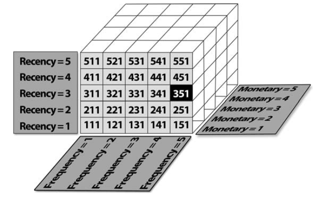

```{r eval=TRUE, message=FALSE, warning=FALSE, include=FALSE}

# Arbeitsumgebung leeren (alle Objekte entfernen)
rm(list = ls())
gc()

# Root für Quarto setzen
knitr::opts_knit$set(root.dir = here::here())

# Installiere und lade erforderliche Bibliotheken
if (!requireNamespace("reticulate", quietly = TRUE)) install.packages("reticulate")
if (!requireNamespace("rmarkdown", quietly = TRUE)) install.packages("rmarkdown")
if (!requireNamespace("shiny", quietly = TRUE)) install.packages("shiny")
if (!requireNamespace("dplyr", quietly = TRUE)) install.packages("dplyr")
if (!requireNamespace("tidyr", quietly = TRUE)) install.packages("tidyr")
if (!requireNamespace("tidyverse", quietly = TRUE)) install.packages("tidyverse")
if (!requireNamespace("forecast", quietly = TRUE)) install.packages("forecast")
if (!requireNamespace("ggpubr", quietly = TRUE)) install.packages("ggpubr")
if (!requireNamespace("viridis", quietly = TRUE)) install.packages("viridis")


library(reticulate)
library(rmarkdown)
library(shiny)
library(dplyr)
library(tidyr)
library(tidyverse)
library(forecast)
library(ggpubr)
library(viridis)

```

```{python, include=FALSE, eval=TRUE, message=FALSE, warning=FALSE}
# Erforderliche Bibliotheken installieren (falls nicht vorhanden)
import subprocess
import sys

def install_and_import(package):
    try:
        __import__(package)
    except ImportError:
        subprocess.check_call([sys.executable, "-m", "pip", "install", package])
    finally:
        globals()[package] = __import__(package)

# Äquivalente Bibliotheken in Python installieren und importieren
libraries = ["pandas", "numpy", "matplotlib", "seaborn", "scipy", "statsmodels", "pulp"]

for lib in libraries:
    install_and_import(lib)

# Bibliotheken laden
import pandas as pd
import numpy as np
import matplotlib.pyplot as plt
import seaborn as sns
from scipy import stats
from statsmodels.tsa.seasonal import STL
from pulp import LpMaximize, LpProblem, LpVariable, value

```

<!-- ================= 1. Einleitung ================= -->

# Einleitung {#sec-einleitung}

## Problemstellung {#sec-problemstellung}

Der Onlinehandel hat sich zu einem der wichtigsten Vertriebskanäle entwickelt. Millionen von Kunden kaufen regelmäßig ein, doch ihre Verhaltensweisen unterscheiden sich erheblich. Manche Kunden tätigen häufig kleine Käufe, andere bestellen selten, geben dabei aber hohe Summen aus. Hinzu kommen Unterschiede in der Sortimentswahl, im Preisbewusstsein und in der Reaktion auf Kampagnen.

Für Unternehmen liegt darin einerseits eine große Chance, da differenzierte Segmente eine gezielte Ansprache und Bindung ermöglichen. Andererseits stellt diese Vielfalt eine Herausforderung dar. Klassische Auswertungen wie Umsatzstatistiken oder Produktlisten zeigen nur an der Oberfläche Unterschiede, erfassen aber nicht die zugrunde liegenden Strukturen. Viele Segmentierungsprojekte scheitern daran, dass sie entweder methodisch zu stark auf Verfahren fokussieren oder dass die Ergebnisse nicht in verständliche, umsetzbare Formate übersetzt werden.

## Zielsetzung {#sec-zielsetzung}

Die Arbeit möchte die Forschungsfrage beantworten, welche Segmentstrukturen sich in E-Commerce-Daten verbergen und wie diese so dargestellt werden können, dass sie für Marketing und CRM unmittelbar nutzbar sind. Mit den Segmentprofilen, den Personas und den daraus abgeleiteten Maßnahmen wird gezeigt, wie Datenmuster in klare Handlungsoptionen übersetzt werden können. Clustering wird dabei als Werkzeug verstanden, nicht als Selbstzweck.

Der Beitrag dieser Arbeit liegt in drei Aspekten. Erstens wird ein nachvollziehbarer Prozess von der Datenbasis über die Merkmalsbildung bis zur Segmentierung entwickelt. Zweitens werden Segmentstrukturen durch Kennzahlen, Visualisierungen und narrative Personas anschaulich aufbereitet. Drittens werden praxisrelevante Maßnahmen für Marketing und Kundenbindung abgeleitet.

## Vorgehensweise {#sec-vorgehensweise}

Das Vorgehen orientiert sich am CRISP-DM-Modell. Zunächst werden theoretische Grundlagen der Kundensegmentierung und die Rolle von Validierungsmaßen erläutert. Anschließend werden die verwendeten Datensätze beschrieben und durch Feature Engineering in aussagekräftige Merkmale transformiert, unter anderem Recency, Frequency, Monetary Value sowie Warenkorb- und Sortimentsvariablen.

Die Segmentierung wird mit zwei Verfahren durchgeführt: K-Means dient als baseline für kompakte Cluster, während HDBSCAN unregelmäßige Strukturen und Rauschen abbilden kann. Die Qualität wird mit Silhouette und DBCV überprüft. Die Hopkins-Statistik wird ergänzend eingesetzt, wobei ihre eingeschränkte Aussagekraft für hochdimensionale Transaktionsdaten kritisch eingeordnet wird.

Im Ergebnisteil werden die Segmente dargestellt, mit Kennzahlen beschrieben und durch Visualisierungen anschaulich gemacht. Personas übersetzen die Ergebnisse in leicht verständliche Profile. Anschließend werden Implikationen für Marketing und CRM diskutiert. Die Arbeit schließt mit einer Reflexion der Ergebnisse, Limitationen und einem Ausblick auf zukünftige Erweiterungen.

<!-- ================= 2. Theoretischer Hintergrund ================= -->

# Theoretischer Hintergrund {#sec-theorie}

## Kundensegmentierung im E-Commerce {#sec-segmentierung-ecommerce}

Kundensegmentierung ist ein zentrales Instrument im Customer Relationship Management (CRM), um heterogene Kundenmengen in homogene Gruppen zu unterteilen und diese gezielt anzusprechen. @tsiptsisDataMiningTechniques2010, S. 39 betonen: “Clustering techniques identify meaningful natural groupings of records and group customers into distinct segments with internal cohesion.” Ziel ist die Entwicklung unterscheidbarer Kundentypologien, die „transparent, meaningful, and actionable“ sind (@tsiptsisDataMiningTechniques2010, S. 129).

Die Bedeutung von Kundensegmentierung im E-Commerce hat mit der Verfügbarkeit umfangreicher Transaktions- und Interaktionsdaten deutlich zugenommen. Personalisierte Angebote, zielgerichtete Kampagnen und differenzierte Kundenbindungsstrategien setzen voraus, dass heterogene Kundenmengen in konsistente Gruppen überführt werden können, die sich anhand ihres Verhaltens und Werts klar unterscheiden.

## Clustering als Mittel zum Zweck {#sec-clustering-werkzeug}

In dieser Arbeit wird Clustering nicht als Selbstzweck betrachtet, sondern als Werkzeug, um verborgene Muster zu erkennen und in verständliche Kundensegmente zu übersetzen. Zwei Verfahren stehen dabei im Mittelpunkt: K-Means und HDBSCAN.

K-Means basiert auf der Idee, die Varianz innerhalb von Clustern iterativ zu reduzieren. Es „starts with an initial cluster solution which is updated and adjusted until no further refinement is possible … Each iteration refines the solution by reducing the within-cluster variation“ (@tsiptsisDataMiningTechniques2010, S. 85). Jedes Cluster wird dabei durch sein Zentrum (Zentroid) repräsentiert, und die Anzahl der Cluster muss vorab festgelegt werden. Dieses Verfahren eignet sich besonders für kompakte, globuläre Strukturen. 

HDBSCAN hingegen ist eine Weiterentwicklung dichtebasierter Verfahren. Dichtebasierte Ansätze identifizieren Gruppen in Regionen hoher Punktdichte und weisen spärlich besetzte Bereiche als Rauschen aus; DBSCAN nutzt dafür die Parameter $\varepsilon$ und MinPts (@chakrabortyDataClassificationIncremental2022, S. 87–88). Damit lassen sich auch nicht-konvexe Formen abbilden und Ausreißer explizit behandeln. K-Means eignet sich dagegen vor allem für kompakte, annähernd kugelförmige Strukturen, während hierarchische bzw. dichtebasierte Verfahren arbiträre Formen robuster erfassen können (@chakrabortyDataClassificationIncremental2022, S. 96). HDBSCAN kombiniert diese Eigenschaften, indem es auf einer hierarchischen Betrachtung lokaler Dichten aufbaut und dadurch stabilere Cluster extrahieren kann.

Der gesamte Prozess wird im Rahmen von CRISP-DM strukturiert. @wirthCRISPDMStandardProcess2000, S. 4 beschreiben: „The life cycle of a data mining project is broken down in six phases“, die von Business Understanding über Data Understanding und Data Preparation bis zu Modeling, Evaluation und Deployment reichen. Diese Phasen sind nicht linear, sondern hochgradig iterativ: “it is never the case that a phase is completely done before the subsequent phase starts” (@wirthCRISPDMStandardProcess2000, S. 9). Eine ausführliche Darstellung und die konkrete Anwendung auf diese Arbeit finden sich in [Anhang B: Prozessmodelle](#sec-anhangB).

## Validierung (Hopkins, Silhouette, DBCV) als Qualitätskontrolle {#sec-validierung}

Damit die mit Clustering identifizierten Muster belastbar sind, müssen ihre Ergebnisse überprüft werden. Dazu dienen Validierungsmaße, die im Folgenden vorgestellt werden.  

Die Hopkins-Statistik prüft, ob ein Datensatz überhaupt eine Clustertendenz enthält. @acitoPredictiveAnalyticsKNIME2023, S. 271 beschreiben sie als Maß, „to assess the clustering tendency of a data set by measuring the probability that a uniform data distribution generates a given data set“. Werte über 0,75 deuten auf eine starke Clustertendenz hin, Werte nahe 0,5 auf Zufälligkeit. Bei hochdimensionalen E-Commerce-Daten ist die Aussagekraft jedoch eingeschränkt, weshalb Hopkins in dieser Arbeit nur ergänzend berücksichtigt wird.  

Der Silhouette-Koeffizient bewertet die Kohäsion innerhalb von Clustern und die Separation zwischen Clustern. Er kombiniert also zwei Perspektiven: interne Homogenität und externe Abgrenzung. @tsiptsisDataMiningTechniques2010, S. 209 nennen die Silhouette als ein zentrales Kriterium der technischen Evaluation. @laiSilhouetteCoefficientbasedWeighting2025, S. 3063 ergänzen, dass sie ein objektives Maß sei, weil sie „both the cohesion within clusters and the separation between clusters“ berücksichtigt.  

Es lassen sich eindimensionale und mehrdimensionale Ansätze unterscheiden. Eindimensionale Verfahren ordnen Kunden nach einem einzelnen Merkmal, meist Umsatz oder Profit. Ein klassisches Beispiel ist die Value-based Segmentation, bei der Kunden nach Wert geordnet und anschließend in Quantile eingeteilt werden (@tsiptsisDataMiningTechniques2010, S. 194, S. 219). Dieser Ansatz ist zwar leicht verständlich, bildet jedoch die Vielfalt des Kundenverhaltens nur eingeschränkt ab. Eine genauere Einordnung eindimensionaler Verfahren findet sich in [Anhang A.1: Eindimensionale Segmentierung](#sec-anhangA1).  

Demgegenüber berücksichtigen mehrdimensionale Ansätze mehrere Merkmale gleichzeitig. Besonders etabliert ist die RFM-Analyse, die Recency, Frequency und Monetary Value kombiniert. @tsiptsisDataMiningTechniques2010, S. 337 schlagen vor, „to use the respective components as inputs in a clustering model and let the algorithm reveal the underlying natural groupings of customers“. Auf diese Weise entsteht ein mehrdimensionaler Merkmalsraum, in dem differenziertere Segmente sichtbar werden. Moderne Anwendungen erweitern RFM zudem um Variablen wie Warenkorbgrößen oder Sortimentspräferenzen. Eine detaillierte Übersicht zur RFM-Segmentierung findet sich in [Anhang A.2: Mehrdimensionale RFM-Segmentierung](#sec-anhangA2).

Für dichtebasierte Verfahren wie HDBSCAN ist der DBCV-Index geeignet. @moulaviDensityBasedClusteringValidation2014, S. 839 erklären, dass DBCV die „within and between-cluster density connectedness“ misst, während Rauschen explizit berücksichtigt wird. Der Vorteil liegt darin, dass dieses Maß auch für arbiträre Clusterformen robust anwendbar ist (@moulaviDensityBasedClusteringValidation2014, S. 845).  

Dabei ist zu berücksichtigen, dass interne Validierungsmaße wie Silhouette oder DBCV lediglich strukturelle Eigenschaften der Clusterlösungen abbilden. Sie garantieren nicht, dass die Segmente geschäftlich relevant sind. Ohne eine anschließende inhaltliche Interpretation besteht die Gefahr, rechnerisch erzeugte Gruppen zu überinterpretieren.  

Diese theoretischen Grundlagen bilden den Rahmen, um in der folgenden Untersuchung herauszuarbeiten, welche Segmentstrukturen sich in E-Commerce-Daten verbergen und wie sie so beschrieben werden können, dass sie für Marketing und CRM unmittelbar nutzbar sind.


<!-- ================= 3. Datenbasis und Aufbereitung ================= -->

# Datenbasis und Aufbereitung {#sec-datenbasis}

## Roadmap der Segmentierung im Projekt {#sec-roadmap}

Die Abbildung [@fig-segmentation-angepasst] veranschaulicht den konzeptionellen Ablauf der Segmentierung im Rahmen dieser Studie. Ausgangspunkt sind zahlreiche einzelne Beobachtungen, die in den Datensätzen Online Retail II und RetailRocket vorliegen. Diese Vielzahl an Transaktionen, Warenkörben und Interaktionen erscheint zunächst unstrukturiert und komplex.  

Im nächsten Schritt werden diese Daten mithilfe von Clustering-Verfahren wie K-Means und HDBSCAN in Gruppen überführt, die gemeinsame Muster erkennen lassen. Die entstehenden Cluster verdichten sich zu interpretierbaren Segmenten, die durch Kennzahlen, Profile und Personas beschrieben werden können. Dieser Übergang macht sichtbar, dass Segmentierung nicht nur eine rechnerische Klassifikation ist, sondern eine inhaltliche Reduktion von Datenkomplexität in klar unterscheidbare Kundengruppen.  

Der abschließende Teil der Abbildung symbolisiert die strategische Nutzung dieser Segmente. Auf Basis der erarbeiteten Kundengruppen können konkrete Maßnahmen für Marketing und CRM entwickelt werden. Damit endet der Prozess nicht bei der Modellierung, sondern wird in eine übergeordnete Strategie überführt, die operative Entscheidungen und Kampagnen unterstützt. Die Visualisierung verdeutlicht somit die Transformation von Rohdaten über Cluster und Segmente hin zu strategischen Maßnahmen und bildet den roten Faden für den weiteren praktischen Teil der Arbeit.  

{#fig-segmentation-angepasst width=100%}

Die dargestellte Roadmap knüpft an das in [B.2: Segmentation Management Strategy im Kontext von CRISP-DM](#sec-anhangB.2) erläuterte Referenzmodell an. Sie macht deutlich, dass der Segmentierungsprozess als Abfolge von Transformationen zu verstehen ist, die von der Datenbasis über die Modellierung bis zur strategischen Umsetzung führen.

Im Anschluss an die Beschreibung der Datensätze erfolgt die Merkmalsbildung durch Feature Engineering. Dabei werden aus den Rohdaten zentrale Kennzahlen wie Recency, Frequency, Monetary Value sowie warenkorb- und sortimentsbezogene Variablen abgeleitet. Erst durch diese Konstrukte wird es möglich, im nächsten Schritt Clustermodelle anzuwenden.  

Schließlich wird im dritten Teil die Datenaufbereitung behandelt, die für die Robustheit der Modelle entscheidend ist. Dazu gehören die Bereinigung von Ausreißern, die Handhabung fehlender Werte sowie die Skalierung der Merkmale. Mit diesen vorbereitenden Schritten wird die Basis geschaffen, auf der die in der Roadmap dargestellte Transformation technisch und analytisch realisiert werden kann.


## Datensätze Online Retail II / RetailRocket {#sec-datensaetze}

Um die Forschungsfrage zu beantworten, welche Segmentstrukturen sich in E-Commerce-Daten verbergen und wie diese darstellbar sind, werden zwei komplementäre Datensätze genutzt. RetailRocket erfasst ereignisbasierte Interaktionen wie Ansichten, Warenkorbaktionen und Transaktionen [@zykovRetailrocketRecommenderSystem2022]. Online Retail II hingegen stellt transaktionsbasierte Rechnungsdaten mit Artikelnummern, Mengen, Preisen und Zeitstempeln bereit [@DatasetsUCIMachine2019].  

Die Kombination beider Perspektiven erlaubt es, sowohl verhaltensnahe Muster (RetailRocket) als auch wertorientierte Strukturen (Online Retail II) zu identifizieren. Damit wird die Grundlage gelegt, um robuste und vielseitige Segmentstrukturen zu erschließen.

## Feature Engineering (RFM, Frequenz, Warenkorb) {#sec-feature-engineering}

Ein zentrales Element des Feature Engineerings ist die Ableitung der klassischen RFM-Variablen (Recency, Frequency, Monetary). Diese gelten im Handel als Standardmethode zur Kundensegmentierung, da sie Kundenverhalten kompakt und interpretierbar zusammenfassen [@tsiptsisDataMiningTechniques2010, S. 333–338]. \smallskip 

- Recency beschreibt die Zeitspanne seit dem letzten Kauf.  
- Frequency gibt an, wie viele Käufe in einem bestimmten Zeitraum erfolgen.  
- Monetary steht für das Umsatzvolumen, das in diesem Zeitraum erzielt wurde. 

\noindent Die RFM-Logik wird in dieser Arbeit um zusätzliche Variablen erweitert: \smallskip

- Warenkorbmerkmale, z. B. durchschnittliche Warenkorbgröße oder Vielfalt der Kategorien.  
- Zeitorientierte Muster, z. B. bevorzugte Einkaufszeitpunkte (Wochentag, Uhrzeit).  

\noindent Damit entsteht ein erweitertes Merkmalsset, das sowohl wertorientierte als auch verhaltensnahe Aspekte des Kundenhandelns abbildet. Dieses Set bildet die Grundlage für die nachfolgende Clusteranalyse mit K-Means und HDBSCAN.  

Zur Berechnung kann auch ein kontinuierlicher RFM-Score herangezogen werden, der die Dimensionen zu einer gewichteten Kennzahl kombiniert:

$$
RFM\_score = (recency\_score \times w_R) + (frequency\_score \times w_F) + (monetary\_score \times w_M)
$$

Die Gewichtung $w_R$, $w_F$ und $w_M$ hängt vom Anwendungskontext ab und kann durch Expertenschätzung oder empirische Optimierung bestimmt werden.  

Eine vertiefte Darstellung der RFM-Segmentierung, einschließlich der klassischen Zellstruktur (z. B. 5 × 5 × 5 = 125 Segmente), befindet sich in [Anhang A.3: Retail-Segmentierung mit RFM](#sec-anhangA3).  


## Bereinigung, Skalierung {#sec-bereinigung}

Die Aussagekraft identifizierter Segmentstrukturen hängt wesentlich von der Qualität der Daten ab. Deshalb werden die Datensätze vor der Modellierung bereinigt und skaliert [@wirthCRISPDMStandardProcess2000, S. 6].  

Hierzu zählen die Entfernung von Duplikaten und fehlerhaften Einträgen, die Handhabung von Rückgaben sowie die Vereinheitlichung von Zeitstempeln. Fehlende Werte werden behandelt und extreme Ausreißer geprüft, da sie Clusterzentren verzerren können [@chakrabortyDataClassificationIncremental2022, S. 87–89]. Anschließend erfolgt die Skalierung der Variablen, sodass unterschiedliche Größenordnungen (z. B. Umsätze vs. Kaufhäufigkeiten) vergleichbar werden.  

Durch diese Schritte wird gewährleistet, dass die späteren Clusterlösungen auf konsistenten und robusten Daten basieren. Damit trägt die Aufbereitung direkt dazu bei, die Forschungsfrage fundiert zu beantworten: Segmentstrukturen lassen sich nur dann erkennen und sinnvoll darstellen, wenn die Datenqualität sichergestellt ist.

<!-- ================= 4. Segmentierung ================= -->

# Segmentierung {#sec-segmentierung}

## K-Means (kurz als baseline) {#sec-kmeans}
<!-- Geometriebasiertes Verfahren für kompakte Cluster -->

## HDBSCAN (kurz für dichtebasierte Strukturen) {#sec-hdbscan}
<!-- Dichtebasiertes Verfahren für arbiträre Clusterformen -->

## Validierung mit Silhouette und DBCV (nur Ergebnisse) {#sec-validierung-ergebnisse}
<!-- Vergleich der Gütemaße -->

<!-- ================= 5. Ergebnisse: Kundensegmente ================= -->

# Ergebnisse: Kundensegmente {#sec-ergebnisse}

## Clusterprofile (Tabellen, Kennzahlen) {#sec-clusterprofile}
<!-- Segmentgrößen, RFM-Werte, Umsatzanteile -->

## Personas (kurze Beschreibungen pro Segment) {#sec-personas}
<!-- Typische Kundenprofile und Verhaltensweisen -->

## Visualisierungen (z. B. Radarplots, Heatmaps) {#sec-visualisierungen}
<!-- Grafische Aufbereitung der Unterschiede -->

<!-- ================= 6. Implikationen für Marketing und CRM ================= -->

# Implikationen für Marketing und CRM {#sec-marketing}

## Mögliche Maßnahmen je Segment {#sec-massnahmen}
<!-- Marketingstrategien und CRM-Maßnahmen -->

## Nutzen für Kampagnensteuerung und Kundenbindung {#sec-nutzen}
<!-- Geschäftlicher Mehrwert der Segmentierung -->

## Grenzen und Risiken {#sec-grenzen}
<!-- Limitationen und potenzielle Probleme -->

<!-- ================= 7. Fazit und Ausblick ================= -->

# Fazit und Ausblick {#sec-fazit}

## Beantwortung der Forschungsfrage {#sec-forschungsfrage}

Die Arbeit hat gezeigt, dass sich in E-Commerce-Daten mehrere klar unterscheidbare Segmente identifizieren lassen. Diese unterscheiden sich sowohl in quantitativen Kennzahlen wie Kaufhäufigkeit, Umsatzhöhe und Sortimentspräferenzen als auch in charakteristischen Verhaltensmustern. Mit den aufbereiteten Profilen, Personas und Visualisierungen konnten die Unterschiede verständlich gemacht und in praxisnahe Maßnahmen überführt werden. Damit wurde die Forschungsfrage beantwortet, wie Segmentstrukturen in E-Commerce-Daten sichtbar gemacht und für Marketing und CRM nutzbar aufbereitet werden können.

Die eingesetzten Verfahren haben dabei ihren Zweck erfüllt. K-Means und HDBSCAN dienten als Werkzeuge, um Strukturen sichtbar zu machen. Silhouette und DBCV überprüften die Qualität der Ergebnisse. Die Hopkins-Statistik wurde ergänzend einbezogen, zeigte erwartungsgemäß kaum Clusterfähigkeit und machte deutlich, dass manche Validierungsansätze in diesem Kontext methodisch nur begrenzt aussagekräftig sind.

## Limitationen {#sec-limitationen}

Die Ergebnisse basieren auf internen Validitätsmaßen und bieten keinen direkten Nachweis, ob segmentbasierte Maßnahmen in der Praxis zu besseren Erfolgen führen. Auch die Datenbasis weist Einschränkungen auf. Transaktions- und Eventdaten sind häufig unbalanciert, enthalten Ausreißer und bilden nicht alle relevanten Kundenmerkmale ab. Die Generalisierbarkeit auf andere Märkte oder Shops ist daher begrenzt.

## Ausblick (z. B. Text Mining, Echtzeit-Segmentierung) {#sec-ausblick}

Für zukünftige Arbeiten empfiehlt sich die Ergänzung um externe Validierung. A/B-Tests und Uplift-Analysen könnten zeigen, ob segmentierte Kampagnen tatsächlich bessere Ergebnisse liefern. Eine Erweiterung der Merkmalsbasis durch Text Mining von Kundenbewertungen oder die Analyse von Session-Daten könnte zusätzliche Differenzierung schaffen. Auch eine dynamische Segmentierung, die sich in Echtzeit an Veränderungen im Verhalten anpasst, wäre ein sinnvoller Schritt. Schließlich sollte die Segmentlogik direkt in CRM-Systeme integriert werden, um einen geschlossenen Kreislauf zwischen Analyse, Umsetzung und Erfolgsmessung zu schaffen.

Was eine \gls{mfa} ist, wird im Glossar beschrieben.

<!-- ================= Literaturverzeichnis ================= -->

# Literaturverzeichnis {.unnumbered}

::: {#refs}
:::
\pagestyle{literature}
\markboth{Literaturverzeichnis}{Literaturverzeichnis}

\clearpage

<!-- ================= Anhangsverzeichnis-Header ================= -->

::: {#sec-anhang}
# Anhang {.unnumbered}
:::
\markboth{Anhang}{Anhang} 
\thispagestyle{empty}
\renewcommand{\thefigure}{A.\arabic{figure}}
\setcounter{figure}{0}


::: {#sec-anhangsverzeichnis}
## Anhangsverzeichnis {.unnumbered}
:::
\pagestyle{appendixTOC}
\noindent
<!-- ================= Anhangsverzeichnis ================= -->


**Anhang A** [RFM-Segmentierung](#sec-anhangA) \dotfill  \pageref{sec-anhangA}

&nbsp;&nbsp;&nbsp;**A.1** [Eindimensionale Segmentierung](#sec-anhangA.1) \dotfill  \pageref{sec-anhangA.1}

&nbsp;&nbsp;&nbsp;**A.2** [Mehrdimensionale RFM-Segmentierung](#sec-anhangA.2) \dotfill  \pageref{sec-anhangA.2}

&nbsp;&nbsp;&nbsp;**A.3** [Retail-Segmentierung mit RFM](#sec-anhangA.3) \dotfill  \pageref{sec-anhangA.3}

**Anhang B** [Methodische und strategische Bezugsrahmen](#sec-anhangB) \dotfill  \pageref{sec-anhangB}

&nbsp;&nbsp;&nbsp;**B.1** [Das CRISP-DM-Modell](#sec-anhangB.1) \dotfill  \pageref{sec-anhangB.1}
 
&nbsp;&nbsp;&nbsp;**B.2** [Segmentation Management Strategy im Kontext von CRISP-DM](#sec-anhangB.2) \dotfill  \pageref{sec-anhangB.2}


\clearpage

<!-- ================= Anhang ================= -->
\pagestyle{appendix} 
::: {#sec-anhangA}
# Anhang A: RFM-Segmentierung {.unnumbered}
:::
\markboth{Anhang A: RFM-Segmentierung}{}

Dieser Anhang erläutert die RFM-Segmentierung als ein klassisches Instrument der Kundenanalyse. Im Mittelpunkt stehen die Dimensionen Recency, Frequency und Monetary Value, mit denen Kundenverhalten in strukturierte Kategorien überführt werden kann. Die Darstellung zeigt sowohl einfache eindimensionale Ansätze als auch mehrdimensionale Ausprägungen, die eine differenziertere Sicht auf Kaufmuster und Kundenwert ermöglichen. Damit wird nachvollziehbar, weshalb RFM-Modelle eine wichtige Grundlage für moderne Verfahren der Kundensegmentierung bilden.

\clearpage

::: {#sec-anhangA.1}
## A.1: Eindimensionale Segmentierung {.unnumbered}
:::

Eindimensionale Verfahren klassifizieren Kunden nach einem einzigen Kriterium, etwa Umsatz oder Profit. Typisch ist die Value-based Segmentation, bei der Kunden nach Wert geordnet und in Quantile eingeteilt werden (@tsiptsisDataMiningTechniques2010, S. 193, S. 219). Solche Verfahren sind einfach zu implementieren und liefern schnelle Ergebnisse, bilden jedoch die Komplexität des Kundenverhaltens nicht vollständig ab.

::: {#sec-anhangA.2}
## A.2: Mehrdimensionale RFM-Segmentierung {.unnumbered}
:::

Die RFM-Analyse kombiniert drei Dimensionen: Recency, Frequency und Monetary Value. @tsiptsisDataMiningTechniques2010, S. 336–345 beschreiben RFM als bewährten Ansatz, um Kundenwerte differenziert abzubilden. Neben der klassischen Zellenbildung (z. B. Quintile) kann RFM auch als Input für Clustering genutzt werden. Dadurch entstehen mehrdimensionale Segmente, die sich deutlich voneinander unterscheiden. Erweiterungen des Modells beziehen zusätzliche Merkmale wie Warenkorbgrößen oder Sortimentspräferenzen ein, um die Aussagekraft weiter zu erhöhen.

::: {#sec-anhangA.3}
## A.3: Retail-Segmentierung mit RFM {.unnumbered}
:::

Die RFM-Segmentierung ist eine im Handel etablierte Methode, um Kunden anhand von Kaufhistorien zu klassifizieren. Tsiptsis und Chorianopoulos [@tsiptsisDataMiningTechniques2010, S. 334–338] beschreiben sie als besonders geeignet, um Verhalten in standardisierte Segmente zu überführen.  

**Dimensionen:**
- *Recency:* Zeit seit dem letzten Einkauf (z. B. Tage, Wochen, Monate).  
- *Frequency:* Anzahl der Einkäufe im Analysezeitraum.  
- *Monetary:* Umsatzsumme im Analysezeitraum.  

Typischerweise werden die Werte in **Quantile** (z. B. Quintile) eingeteilt. So entstehen R-, F- und M-Scores zwischen 1 und 5. Die Kombination der drei Scores ergibt bis zu 125 RFM-Zellen. Beispiel:  
- Zelle **555** = Top-Kunden (jüngster Kauf, höchste Frequenz, höchster Umsatz).  
- Zelle **151** = Wenig aktive Kunden (letzter Kauf lange her, niedrige Frequenz, geringer Umsatz).  

{#fig-rfm width=80%}  

**Vor- und Nachteile:**
- Vorteil: leicht verständlich und direkt interpretierbar.  
- Nachteil: Hohe Anzahl an möglichen Zellen (z. B. 125 bei Quintilen) führt zu Unübersichtlichkeit.  

Eine Alternative ist die Aggregation zu einem **kontinuierlichen RFM-Score** (vgl. Formel in Kapitel 3), der weniger granular, aber handhabbarer ist.  

Diese theoretische Fundierung verdeutlicht, warum RFM im Handel bis heute ein zentrales Verfahren darstellt und zugleich als Ausgangspunkt für weiterführende Clustering-Verfahren (z. B. K-Means, HDBSCAN) genutzt wird.

```{python echo=TRUE, EVAL=TRUE, INCLUDE=TRUE}
import matplotlib.pyplot as plt
from mpl_toolkits.mplot3d.art3d import Poly3DCollection

def plot_rfm_cube_with_front_labels():
    """
    Erstellt eine 3D-Darstellung des RFM-Würfels mit:
    - Zahlen auf der Vorderseite (sichtbare Frontfläche von 111 bis 551).
    - Vollständiger Würfelstruktur und korrekt sichtbaren Hilfslinien.
    """
    # Dimensionen des Würfels
    recency_levels = 5
    frequency_levels = 5
    monetary_levels = 5  # Vollständiger Würfel, aber nur die Frontseite wird beschriftet

    # Erstellen der 3D-Grafik
    fig = plt.figure(figsize=(10, 8))
    ax = fig.add_subplot(111, projection='3d')

    # Iterieren durch die Werte und Quader zeichnen
    for r in range(1, recency_levels + 1):  # Recency
        for f in range(1, frequency_levels + 1):  # Frequency
            for m in range(1, monetary_levels + 1):  # Monetary
                x, y, z = r - 0.5, f - 0.5, m - 0.5

                # Quader zeichnen
                vertices = [
                    [x, y, z],
                    [x + 1, y, z],
                    [x + 1, y + 1, z],
                    [x, y + 1, z],
                    [x, y, z + 1],
                    [x + 1, y, z + 1],
                    [x + 1, y + 1, z + 1],
                    [x, y + 1, z + 1],
                ]
                faces = [
                    [vertices[j] for j in [0, 1, 5, 4]],  # Unterseite
                    [vertices[j] for j in [2, 3, 7, 6]],  # Oberseite
                    [vertices[j] for j in [0, 3, 7, 4]],  # Seite 1
                    [vertices[j] for j in [1, 2, 6, 5]],  # Seite 2
                    [vertices[j] for j in [0, 1, 2, 3]],  # Vorderseite
                    [vertices[j] for j in [4, 5, 6, 7]],  # Rückseite
                ]
                ax.add_collection3d(Poly3DCollection(faces, alpha=1.0, edgecolor='k', facecolor='skyblue'))

                # Zahlen nur auf der sichtbaren Frontseite (Monetary = 1)
                if m == 1:
                    label = f"{r}{f}{m}"
                    ax.text(r - 0.5 + 0.5, f - 0.5 + 0.5, m - 1, label,
                            color='black', fontsize=10, ha='center', va='center', fontweight='bold')

    # Achsentitel und Achsenlimits
    ax.set_title("RFM-Würfel", fontsize=16, fontweight='bold', pad=20)
    ax.set_xlabel("Recency", fontsize=12, labelpad=15)
    ax.set_ylabel("Frequency", fontsize=12, labelpad=15)
    ax.set_zlabel("Monetary", fontsize=12, labelpad=15)
    ax.set_xlim(0, recency_levels)
    ax.set_ylim(0, frequency_levels)
    ax.set_zlim(0, monetary_levels)

    # Achsenticks anpassen
    ax.set_xticks(range(1, recency_levels + 1))
    ax.set_yticks(range(1, frequency_levels + 1))
    ax.set_zticks(range(1, monetary_levels + 1))

    # Kamera-Perspektive anpassen
    ax.view_init(elev=20, azim=30)

    # Zeigen der Grafik
    plt.show()

# Aufrufen der Funktion
plot_rfm_cube_with_front_labels()


```

\clearpage

::: {#sec-anhangB}
# Anhang B: Prozessmodelle {.unnumbered}
:::
\markboth{Anhang B: Prozessmodelle}{}

Dieser Anhang stellt zwei etablierte Prozessmodelle vor, die für Datenanalyse und Segmentierungsstrategien maßgeblich sind. Mit dem CRISP-DM-Referenzmodell wird ein methodischer Rahmen für die systematische Durchführung von Data-Mining-Projekten beschrieben. Ergänzend veranschaulicht die Segmentation Management Strategy, wie analytisch gewonnene Kundensegmente in strategische Marketing- und CRM-Maßnahmen überführt werden können. Die Kombination macht deutlich, dass erfolgreiche Segmentierung sowohl methodisch fundiert als auch organisatorisch eingebettet sein muss.

\clearpage

::: {#sec-anhangB.1}
## B.1: Das CRISP-DM-Modell {.unnumbered}
:::

Die @fig-crisp-dm zeigt das CRISP-DM-Referenzmodell mit seinen sechs Phasen Business Understanding, Data Understanding, Data Preparation, Modeling, Evaluation und Deployment. Pfeile markieren die zentralen Abhängigkeiten, während der äußere Kreis den iterativen, zyklischen Charakter des Vorgehens unterstreicht. Das Modell ist als allgemeiner Rahmen entworfen und unabhängig von Anwendungsdomäne oder eingesetzter Software.


{#fig-crisp-dm width=50%}

Jede der sechs Phasen ist in spezifische Aufgaben untergliedert, die den Ablauf systematisieren und nachvollziehbar machen. So umfasst Data Understanding das Beschreiben, Erkunden und Überprüfen der Datenqualität, während Data Preparation Aufgaben wie Auswählen, Bereinigen, Konstruieren und Integrieren von Daten vorsieht. Modeling beinhaltet die Wahl geeigneter Verfahren, die Erstellung eines Testdesigns sowie den Aufbau und die Bewertung von Modellen. Evaluation konzentriert sich auf die Überprüfung der Ergebnisse im Hinblick auf die Projektziele, und Deployment behandelt die Bereitstellung und Nutzung der Modelle im Anwendungskontext. Wirth und Hipp betonen außerdem den stark iterativen Charakter des Modells: Ergebnisse einer Phase können jederzeit zu Rücksprüngen führen, wodurch die Arbeitsschritte flexibel angepasst werden können (@wirthCRISPDMStandardProcess2000, S. 6–9).


::: {#sec-anhangB.2}
## B2: Segmentation Management Strategy im Kontext von CRISP-DM {.unnumbered}
:::

Die in @fig-segmentation-strategy dargestellte Roadmap der *Segmentation Management Strategy* zeigt, wie analytisch ermittelte Segmente in eine unternehmerische Nutzung überführt werden können. Sie ergänzt das CRISP-DM-Modell, indem sie die Brücke von der technischen Modellierung hin zur strategischen Implementierung schlägt. Während CRISP-DM beschreibt, wie Daten zu Modellen verarbeitet werden, zeigt die Segmentation Management Strategy, wie diese Modelle in Marketing- und CRM-Maßnahmen eingebettet werden.  

{#fig-segmentation-strategy width=100%}

Die Roadmap besteht aus vier Schritten, die nacheinander zu durchlaufen sind: 

\medskip

**Schritt 1: Identify the customer segments in the database** \smallskip

\noindent Im ersten Schritt werden die ermittelten Segmente in die Kundendatenbank integriert. Kunden erhalten Scores und werden den Segmenten zugewiesen. @tsiptsisDataMiningTechniques2010, S. 213 betonen: *“Initially the segmentation results should be deployed in the customer database. Customers should be scored and assigned into segments.”* Damit ist die organisatorische Grundlage geschaffen, auf der weitere Analysen und Maßnahmen aufbauen.  

\medskip

**Schritt 2: Evaluate and position the segments**  \smallskip

\noindent In einem zweiten Schritt werden die Segmente bewertet und im Marktumfeld positioniert. Dazu gehören Marktumfragen und qualitative Analysen, die Segmente mit zusätzlichen Informationen wie Bedürfnissen, Lebensstil oder Status anreichern. Zudem sollen Wettbewerbsvorteile, Chancen und Risiken identifiziert werden. Die Autoren halten fest, dass *“the possible opportunities and threats should be investigated in order to select the key segments to be targeted with marketing activities tailored to their profiles and needs”* (@tsiptsisDataMiningTechniques2010, S. 214).  

\medskip

**Schritt 3: Perform cost-benefit analysis to prioritize actions per segment** \smallskip

\noindent Darauf folgt eine Kosten-Nutzen-Analyse, die die Profitabilität einzelner Segmente in Relation zu den erwarteten Kosten setzt. Behavioral Drivers wie Kaufhäufigkeit oder Abwanderungsrisiken spielen dabei eine zentrale Rolle. Ziel ist die Priorisierung der Segmente nach ökonomischer Relevanz. *“Effective segmentation management requires insight into the factors that drive customer behaviors … Finally, a cost–benefit analysis can enable the prioritization of the marketing actions to be implemented”* (@tsiptsisDataMiningTechniques2010, S. 215).  

\medskip

**Schritt 4: Build and deliver differentiated strategies** \smallskip

\noindent Im vierten Schritt werden die Segmente mit maßgeschneiderten Strategien adressiert. Spezialisierte Teams entwickeln und implementieren differenzierte Kampagnen, CRM-Maßnahmen und Produktstrategien. Dies umfasst Aspekte wie Kanalmanagement, Marketingservices, Produktmanagement und Markenführung. @tsiptsisDataMiningTechniques2010, S. 216 schreiben hierzu: *“Each team should build and deliver specialized marketing strategies to improve customer handling, develop the relationship with customers, and increase the profitability of each segment.”*  

Die Roadmap verdeutlicht, dass Segmentierung mehr ist als ein analytischer Prozessschritt. Sie muss in eine organisatorische und strategische Logik eingebettet werden, damit Segmente nicht nur statistisch existieren, sondern im Unternehmen handlungsleitend wirken. CRISP-DM liefert dafür den methodischen Rahmen, die Segmentation Management Strategy ergänzt ihn um eine explizite Managementperspektive.  


<!-- ================= Ende ================= -->
